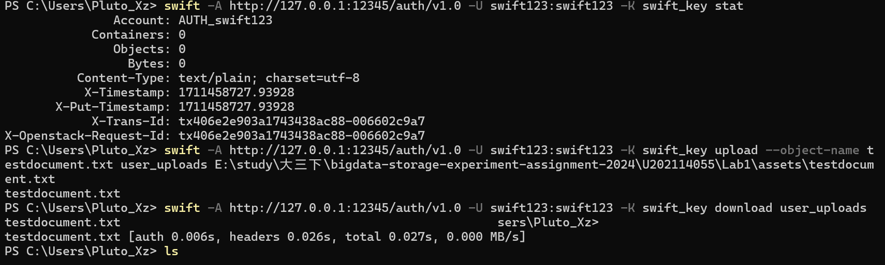
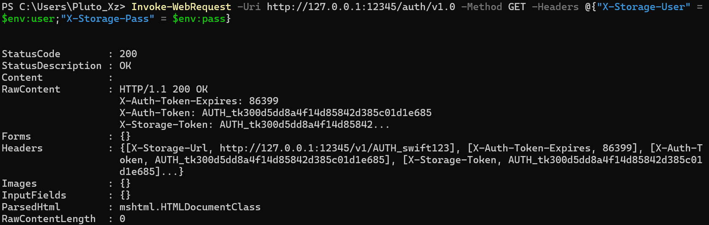
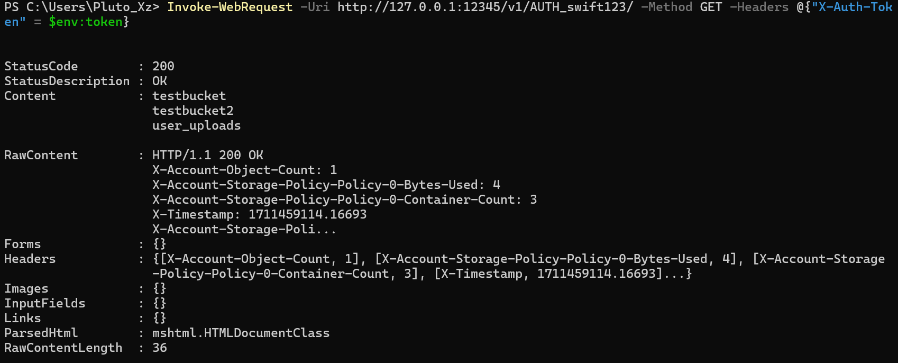
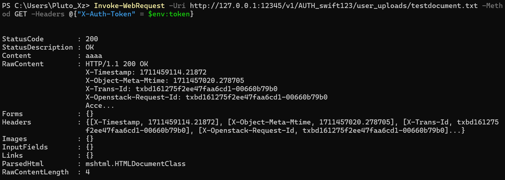
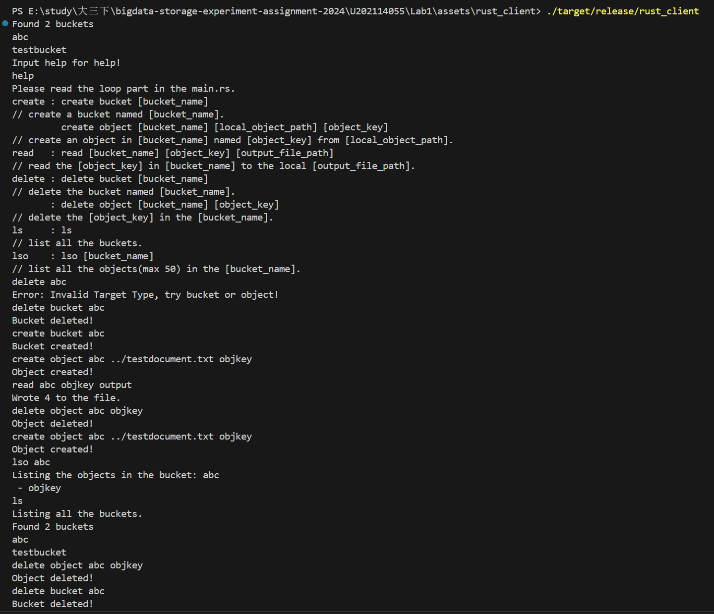

# 实验名称

# 实验环境

# 实验记录

[安装swift](https://hub.docker.com/r/fnndsc/docker-swift-onlyone)


docker ip为172.17.0.2
```
$env:user="swift123:swift123"
$env:pass="swift_key"
Invoke-WebRequest -Uri http://127.0.0.1:12345/auth/v1.0 -Method GET -Headers @{"X-Storage-User" = $env:user;"X-Storage-Pass" = $env:pass}
```

```
$env:token="AUTH_tk300d5dd8a4f14d85842d385c01d1e685"
Invoke-WebRequest -Uri http://127.0.0.1:12345/v1/AUTH_swift123/ -Method GET -Headers @{"X-Auth-Token" = $env:token}
```

```
Invoke-WebRequest -Uri http://127.0.0.1:12345/v1/AUTH_swift123/user_uploads/testdocument.txt -Method GET -Headers @{"X-Auth-Token" = $env:token}
```

经过上面的验证可以发现我们的服务端部署成功。

我们根据下面的资料，使用aws sdk for rust来编写客户端应用程序。
[aws sdk s3文档](https://docs.rs/aws-sdk-s3/latest/aws_sdk_s3/)
[aws sdk s3官方示例](https://docs.aws.amazon.com/zh_tw/sdk-for-rust/latest/dg/rust_s3_code_examples.html)
[详细api网址](https://docs.rs/aws-sdk-s3/latest/aws_sdk_s3/struct.Client.html#method.put_object)

在完成客户端代码的编写之后，进入到/assets/rust_client文件夹中运行cargo run，并且执行如下图所示的命令进行测试：


# 实验小结