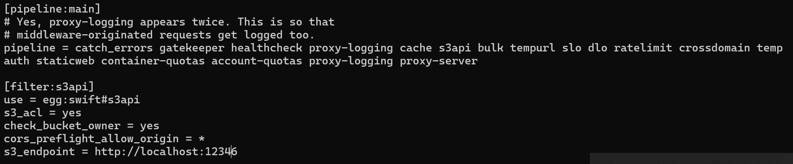
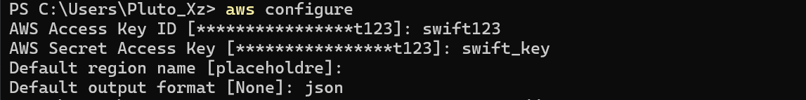

# 实验名称

# 实验环境

# 实验记录

## openstack-swift服务端配置
为了使用swift进行S3 benchmark测试，我们需要对swift进行一定的配置。
`docker exec -it swift-onlyone bash` 进入docker命令行
`find -name "proxy-server.conf"`

首先`apt install swift-plugin-s3`

在配置文件中找到 pipeline = 部分。

[s3api middleware](https://docs.openstack.org/swift/latest/middleware.html#module-swift.common.middleware.s3api.s3api)
将 s3api 中间件添加到 pipeline 中，并确保添加在身份验证中间件之前。
例如这里我们需要将其放到 tempauth的前面。(同时还要确保有bulk和slo，这里我们都默认有)

添加到 pipeline 之后再再后面添加
```conf
[filter:s3api]
use = egg:swift#s3api
s3_acl = yes
check_bucket_owner = yes
cors_preflight_allow_origin = *
s3_endpoint = http://localhost:12346
```



进行完上述配置之后我们重启docker容器，然后在客户端`pip install awscli`安装。
使用指令`aws --endpoint-url=http://127.0.0.1:12345 SWIFT_USERNAME=swift123:swift123 SWIFT_KEY=swift123 s3 ls`

由于我们并不需要连接到aws服务器的服务，所以Key什么的不重要。aws configure之后我这里都设置为“placeholder”（官方文档原话：You must provide an AWS Region and credentials, but they don't have to be valid.）


因为一开始少加了一个端口映射，所以只能先 `docker commit swift-onlyone swift-onlyone-image`保存下来之前的更改
然后再

`docker run -d --name swift-onlyone2 -p 12346:12346 -p 12345:8080 -e SWIFT_USERNAME=swift123:swift123 -e SWIFT_KEY=swift_key -v swift_storage:/srv -t swift-onlyone-image `

最后我们发现还是无法运行，这是使用`find -name "middleware"`查找到swift中间件的位置，在宿主机下载[s3api文件夹](https://github.com/openstack/swift/tree/master/swift/common/middleware)，使用`docker cp localfile containerName:containerPath`复制到docker，然后再移动到swift中间件的路径。
根据[官方添加中间件文档](https://docs.openstack.org/swift/latest/development_middleware.html),发现依然不起作用。

发现我们docker安装的swift版本为2.17，而最新版已经到了2.33.0,其中2.29.0以上才出现s3api（因为官方文档说swift3已经过时被启用，所以我们这里选择使用中间件s3api），所以我们`pip install swift --upgrade`，但是报错，gcc编译失败，`apt install liberasurecode-dev`，依旧报错，使用pip3，最终安装成功。

`swift-init restart all`重新启动swift服务这次成功使用s3api中间件没有报错，之后再次在宿主机上`aws s3 ls --endpoint-url http://127.0.0.1:12345`测试，这次连接成功只是这次报错说我们的`aws configure`的时候不能将region设置为placeholder于是更改为us-east-1。
之后还是报错，我们发现其实并不能随意设置aws configure中的内容，[s3api middleware官网原话](https://docs.openstack.org/swift/latest/middleware.html):make sure you have setting the tempauth middleware configuration in proxy-server.conf, and the access key will be the concatenation of the account and user strings that should look like test:tester, and the secret access key is the account password. The host should also point to the swift storage hostname.

所以我们的access-key是`swift123:swift123`,secret-key是`swift_key`.
最后使用`aws s3 ls --endpoint-url http://127.0.0.1:12345`，没有报错并且成功结束，说明连接并且验证成功。

[aws s3 api](https://docs.aws.amazon.com/zh_cn/cli/latest/userguide/cli-services-s3-commands.html)

设置endpoint_url全局变量[教程文档](https://docs.aws.amazon.com/cli/latest/userguide/cli-configure-endpoints.html)

<!-- 
```conf
[filter:tempauth]
tempurl_key = swift123 // added line
``` -->
<!-- check_bucket_owner = no
cors_preflight_allow_origin = *
s3_endpoint = http://localhost:12346 -->

## rust 客户端配置

[参考文档](https://developer.qiniu.com/kodo/12572/aws-sdk-rust-examples)
使用上述连接中的方式成功使用 aws sdk for rust连接服务端
```
    let access_key_id = "swift123:swift123";
    let secret_access_key = "swift_key";
    
    let config = aws_config::from_env()
        .endpoint_url("http://127.0.0.1:12345".to_string())
        .credentials_provider(SharedCredentialsProvider::new(Credentials::from_keys(
            access_key_id.to_string(),
            secret_access_key.to_string(),
            None,
        )))
        .load()
        .await;
    let s3_local_config = aws_sdk_s3::config::Builder::from(&config).build();
    println!("{:#?}", s3_local_config);
   // println!("{:#?}",config);
    let client = Client::from_conf(s3_local_config);
```
[aws sdk s3文档](https://docs.rs/aws-sdk-s3/latest/aws_sdk_s3/)
[详细api网址](https://docs.rs/aws-sdk-s3/latest/aws_sdk_s3/struct.Client.html#method.put_object)

# 实验小结