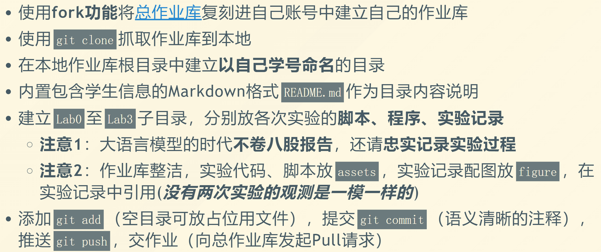
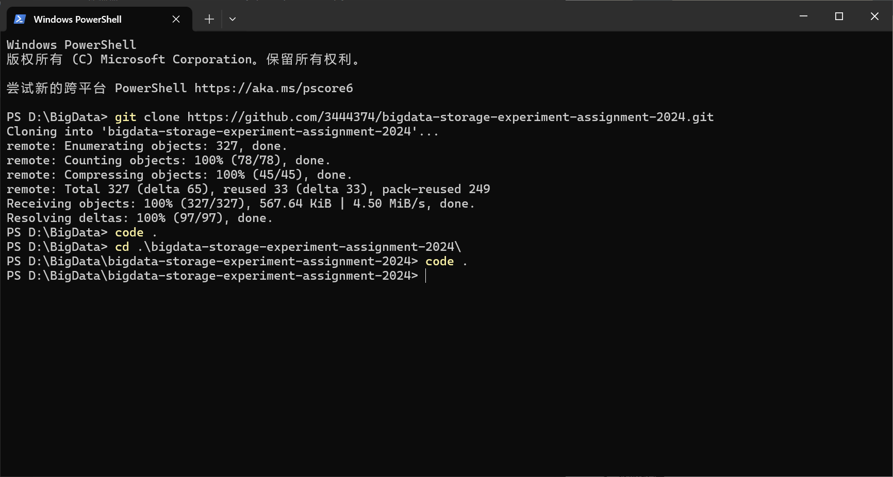
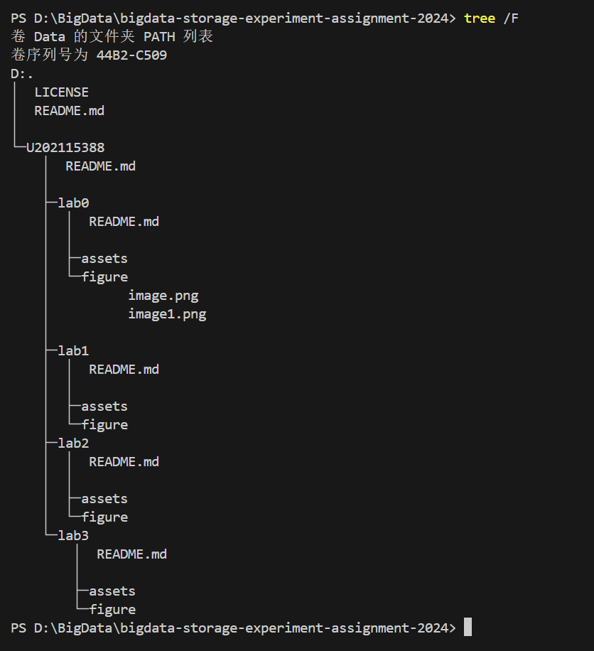
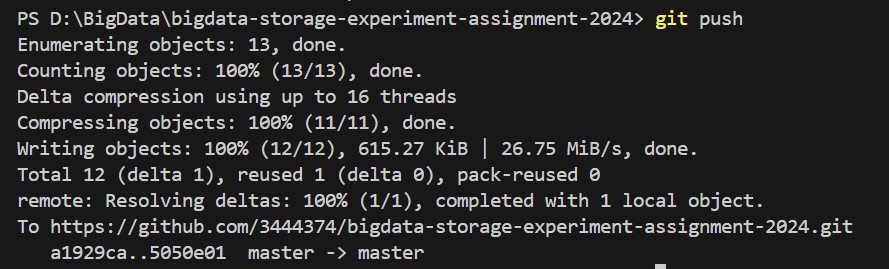

# 准备作业库

# 实验环境

## 设备规格
* 设备名称	LAPTOP-H9DSJ8FK
* 处理器	AMD Ryzen 7 5800H with Radeon Graphics            3.20 GHz
* 机带 RAM	16.0 GB (15.9 GB 可用)
* 设备 ID	F26C7E32-5B2E-4EA7-802C-D25677D53F27
* 产品 ID	00342-36189-43009-AAOEM
* 系统类型	64 位操作系统, 基于 x64 的处理器
* 笔和触控	没有可用于此显示器的笔或触控输入

## Windows规格
* 版本	Windows 10 家庭中文版
* 版本号	22H2
* 安装日期	‎2021/‎6/‎22
* 操作系统内部版本	19045.4170
* 序列号	PF2TSPDV
* 体验	Windows Feature Experience Pack 1000.19054.1000.0

# 实验记录

## 实验lab0：准备作业库
按照Slide中的指示进行操作
1. git clone
    
2. 添加文件夹与对应的README.md
   
3. 添加推送
    
# 实验小结
为本次实验提供了仓库