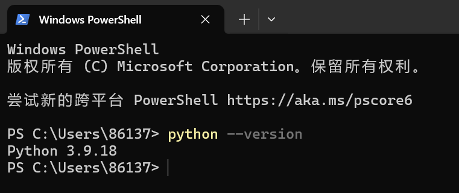
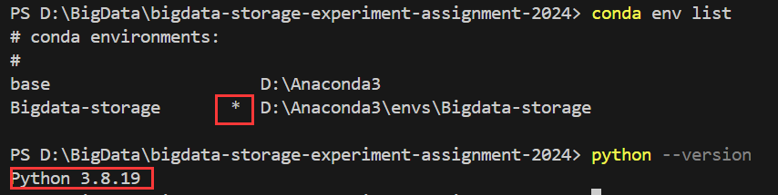
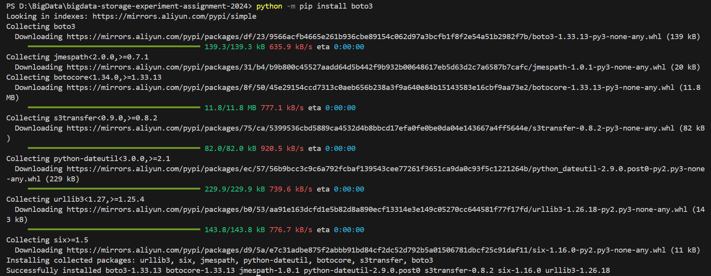
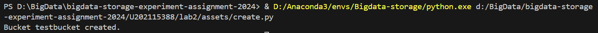
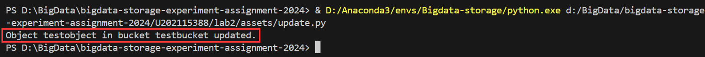
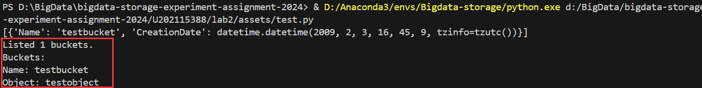
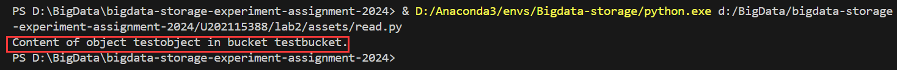
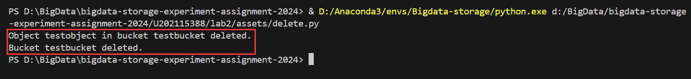
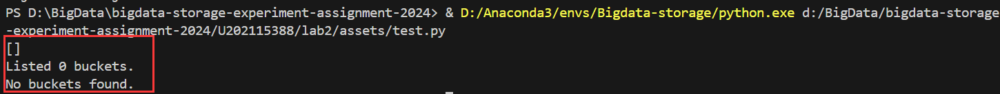

# 实践基本功能
# 实验环境
## 设备规格
* 设备名称	LAPTOP-H9DSJ8FK
* 处理器	AMD Ryzen 7 5800H with Radeon Graphics            3.20 GHz
* 机带 RAM	16.0 GB (15.9 GB 可用)
* 设备 ID	F26C7E32-5B2E-4EA7-802C-D25677D53F27
* 产品 ID	00342-36189-43009-AAOEM
* 系统类型	64 位操作系统, 基于 x64 的处理器
* 笔和触控	没有可用于此显示器的笔或触控输入

## Windows规格
* 版本	Windows 10 家庭中文版
* 版本号	22H2
* 安装日期	‎2021/‎6/‎22
* 操作系统内部版本	19045.4170
* 序列号	PF2TSPDV
* 体验	Windows Feature Experience Pack 1000.19054.1000.0

## 服务端
Openstack-swift
## 客户端
boto3


# 实验记录

## 实验lab2-1：搭建客户端
我选择使用[boto3](https://github.com/boto/boto3)，进入网站之后可以发现要求使用python版本要高于3.7，使用conda创建一个符合要求的环境
``` bash
conda create -n Bigdata-storage python=3.8
```
然后激活环境
``` bash
conda activate Bigdata-storage
```
然后查看是否添加成功
``` bash
conda env list
```
可以看到已经在conda中添加了一个新的虚拟环境并且版本是3.8



然后继续依照boto3的方法进行安装
``` bash
python -m pip install boto3
```
成功安装



## 实验lab2-2：连接服务端

编写 [test.py](.\assets\test.py)，连接docker中的服务端并打印出来其中buckets

``` python
import boto3
from botocore.client import Config

# 指定Swift的S3兼容服务端点
endpoint_url = 'http://localhost:12345'

# 配置访问密钥和秘密密钥
access_key = 'test:tester'
secret_key = 'testing'

# 创建一个S3客户端实例
s3_client = boto3.client(
    's3',
    endpoint_url=endpoint_url,
    aws_access_key_id=access_key,
    aws_secret_access_key=secret_key,
    config=Config(signature_version='s3v4'),  # 确保使用正确的签名版本
)

# 执行操作（例如列出桶）
response = s3_client.list_buckets()
print(response['Buckets'])
print(f'Listed {len(response["Buckets"])} buckets.')
if len(response['Buckets']) == 0:
    print('No buckets found.')
else:
    print('Buckets:')
    for bucket in response['Buckets']:
        # 打印桶的名称以及对象
        print(f'Name: {bucket["Name"]}')
        response = s3_client.list_objects_v2(Bucket=bucket['Name'])
        if 'Contents' in response:
            for obj in response['Contents']:
                print(f'Object: {obj["Key"]}')
        else:
            print('    No objects found.')

``` 
## lab2-3：完成访问持久存储的4项基本操作
###  lab2-3-1：创建桶(Create)
编写[create.py](./assets/create.py)，连接服务端并向其中添加桶
``` python
"""
    添加一个桶
"""

import boto3
from botocore.client import Config

# 指定Swift的S3兼容服务端点
endpoint_url = 'http://localhost:12345'

# 配置访问密钥和秘密密钥
access_key = 'test:tester'
secret_key = 'testing'

# 创建一个S3客户端实例
s3_client = boto3.client(
    's3',
    endpoint_url=endpoint_url,
    aws_access_key_id=access_key,
    aws_secret_access_key=secret_key,
    config=Config(signature_version='s3v4'),  # 确保使用正确的签名版本
)

# 指定要创建的桶的名称
bucket_name = 'your-bucket-name'

# 创建桶
s3_client.create_bucket(Bucket=bucket_name)
print(f'Bucket {bucket_name} created.')
```
可以看到创建了一个叫testbucket的桶


### 实验lab2-3-2：添加对象(Update)
编写[update.py](./assets/update.py)向testbucket中添加testobject的对象

再次运行test.py测试一下，查看桶以及其中的内容

### 实验lab2-3-3：读取桶中的对象(Read)
编写[read.py](./assets/read.py)读取出来testbucket中的object, 与test.py得出的结果一致


### 实验lab2-3-4：删除桶中的对象以及桶(Delete)
编写[delete.py](./assets/delete.py)删除桶中的对象以及桶

然后再次运行test.py查看其中的桶列表以及如果有桶的话查看桶中的内容


# 实验小结
* 在这个实验中，我首先搭建了boto3客户端，然后把客户端与存储系统服务器端连接。
* 然后编写代码，完成了访问持久存储的4项基本操作