# 观测分析性能

# 实验环境

## 设备规格
* 设备名称	LAPTOP-H9DSJ8FK
* 处理器	AMD Ryzen 7 5800H with Radeon Graphics            3.20 GHz
* 机带 RAM	16.0 GB (15.9 GB 可用)
* 设备 ID	F26C7E32-5B2E-4EA7-802C-D25677D53F27
* 产品 ID	00342-36189-43009-AAOEM
* 系统类型	64 位操作系统, 基于 x64 的处理器
* 笔和触控	没有可用于此显示器的笔或触控输入

## Windows规格
* 版本	Windows 10 家庭中文版
* 版本号	22H2
* 安装日期	‎2021/‎6/‎22
* 操作系统内部版本	19045.4170
* 序列号	PF2TSPDV
* 体验	Windows Feature Experience Pack 1000.19054.1000.0

## 服务端
Openstack-swift
## 客户端
boto3

# 实验记录

## 实验lab3-1: 安装s3bench
首先查看当前电脑中go的版本是否符合要求
``` bash
go version
go version go1.21.1 windows/amd64
```
然后按照 [s3bench的教程](https://github.com/igneous-systems/s3bench?tab=readme-ov-file#note-on-regions--endpoints) 安装
注意这里的命令要修改一下否则不会在bin目录下生成可执行文件
``` bash
go install github.com/igneous-systems/s3bench
```
然后检查bin目录下是否有了s3bench
``` bash
dir C:\Users\86137\go\bin
```
输出如下:
``` bash


    目录: C:\Users\86137\go\bin


Mode                 LastWriteTime         Length Name
----                 -------------         ------ ----
-a----        2023/10/31     22:09       17865728 dlv.exe
-a----        2023/10/11     16:22        3574784 go-outline.exe
-a----        2023/10/31     22:09        3763712 gomodifytags.exe
-a----        2023/10/31     22:09        7429120 goplay.exe
-a----         2023/12/9     16:43       30747136 gopls.exe
-a----        2023/10/31     22:09       30723072 gopls.exe~
-a----        2023/10/31     22:09       11100672 gotests.exe
-a----        2023/10/31     22:09        6544896 impl.exe
-a----          2024/4/2     19:30       14966272 s3bench.exe
-a----        2023/10/31     22:09       13362688 staticcheck.exe
```
## 实验lab3-2: 进行简单的测试
为了使用教程中所给的命令，我首先用lab2中的 create.py 创建了一个桶testbucket, 然后稍微修改一下教程中的命令执行
``` bash
 s3bench -accessKey=test:tester -accessSecret=testing -bucket=testbucket -endpoint=http://localhost:12345 -numClients=2 -numSamples=10 -objectNamePrefix=loadgen -objectSize=1024 -region=us-east-1
```
输出如下:
``` bash
Test parameters
endpoint(s):      [http://localhost:12345]
bucket:           testbucket
objectNamePrefix: loadgen
objectSize:       0.0010 MB
numClients:       2
numSamples:       10
verbose:       %!d(bool=false)


Generating in-memory sample data... Done (0s)

Running Write test...

Running Read test...

Test parameters
endpoint(s):      [http://localhost:12345]
bucket:           testbucket
objectNamePrefix: loadgen
objectSize:       0.0010 MB
numClients:       2
numSamples:       10
verbose:       %!d(bool=false)


Results Summary for Write Operation(s)
Total Transferred: 0.010 MB
Total Throughput:  0.03 MB/s
Total Duration:    0.316 s
Number of Errors:  0
------------------------------------
Write times Max:       0.115 s
Write times 99th %ile: 0.115 s
Write times 90th %ile: 0.115 s
Write times 75th %ile: 0.073 s
Write times 50th %ile: 0.061 s
Write times 25th %ile: 0.054 s
Write times Min:       0.016 s


Results Summary for Read Operation(s)
Total Transferred: 0.010 MB
Total Throughput:  0.22 MB/s
Total Duration:    0.044 s
Number of Errors:  0
------------------------------------
Read times Max:       0.018 s
Read times 99th %ile: 0.018 s
Read times 90th %ile: 0.018 s
Read times 75th %ile: 0.007 s
Read times 50th %ile: 0.007 s
Read times 25th %ile: 0.007 s
Read times Min:       0.006 s


Cleaning up 10 objects...
Deleting a batch of 10 objects in range {0, 9}... Succeeded
Successfully deleted 10/10 objects in 177.9074ms
```
可以看到已经可以正常测试了
## 实验lab3-3: 改变 -objectSize 参数
``` bash
 # -objectSize=512
 s3bench -accessKey=test:tester -accessSecret=testing -bucket=testbucket -endpoint=http://localhost:12345 -numClients=2 -numSamples=200 -objectNamePrefix=loadgen -objectSize=512 -region=us-east-1 | Out-File -Encoding utf8 ./output/objectSize512.txt

 # -objectSize=1024
 s3bench -accessKey=test:tester -accessSecret=testing -bucket=testbucket -endpoint=http://localhost:12345 -numClients=2 -numSamples=200 -objectNamePrefix=loadgen -objectSize=1024 -region=us-east-1 | Out-File -Encoding utf8 ./output/objectSize1024.txt

 # -objectSize=2048
 s3bench -accessKey=test:tester -accessSecret=testing -bucket=testbucket -endpoint=http://localhost:12345 -numClients=2 -numSamples=200 -objectNamePrefix=loadgen -objectSize=2048 -region=us-east-1 | Out-File -Encoding utf8 ./output/objectSize2048.txt

 # -objectSize=4096
 s3bench -accessKey=test:tester -accessSecret=testing -bucket=testbucket -endpoint=http://localhost:12345 -numClients=2 -numSamples=200 -objectNamePrefix=loadgen -objectSize=4096 -region=us-east-1 | Out-File -Encoding utf8 ./output/objectSize4096.txt

 # -objectSize=8192
 s3bench -accessKey=test:tester -accessSecret=testing -bucket=testbucket -endpoint=http://localhost:12345 -numClients=2 -numSamples=200 -objectNamePrefix=loadgen -objectSize=8192 -region=us-east-1 | Out-File -Encoding utf8 ./output/objectSize8192.txt

```
## 实验lab3-4: 编写代码汇总结果
从几个txt文件中提取出来需要的参数，然后绘图，代码写在了 [draw_object.py](./assets/draw_object.py) 中。

## 实验lab3-5: 改变 numClients 参数
``` bash
# numClients = 2
s3bench -accessKey=test:tester -accessSecret=testing -bucket=testbucket -endpoint=http://localhost:12345 -numClients=2 -numSamples=200 -objectNamePrefix=loadgen -objectSize=512 -region=us-east-1 | Out-File -Encoding utf8 ./output/numClients2.txt

# numClients = 4
s3bench -accessKey=test:tester -accessSecret=testing -bucket=testbucket -endpoint=http://localhost:12345 -numClients=4 -numSamples=200 -objectNamePrefix=loadgen -objectSize=512 -region=us-east-1 | Out-File -Encoding utf8 ./output/numClients4.txt

# numClients = 6
s3bench -accessKey=test:tester -accessSecret=testing -bucket=testbucket -endpoint=http://localhost:12345 -numClients=6 -numSamples=200 -objectNamePrefix=loadgen -objectSize=512 -region=us-east-1 | Out-File -Encoding utf8 ./output/numClients6.txt

# numClients = 8
s3bench -accessKey=test:tester -accessSecret=testing -bucket=testbucket -endpoint=http://localhost:12345 -numClients=8 -numSamples=200 -objectNamePrefix=loadgen -objectSize=512 -region=us-east-1 | Out-File -Encoding utf8 ./output/numClients8.txt

# numClients = 10
s3bench -accessKey=test:tester -accessSecret=testing -bucket=testbucket -endpoint=http://localhost:12345 -numClients=10 -numSamples=200 -objectNamePrefix=loadgen -objectSize=512 -region=us-east-1 | Out-File -Encoding utf8 ./output/numClients10.txt

```
## 实验lab3-6: 编写代码汇总结果
类似于上一个部分，把输出文件中的结果汇总并绘制图，代码写在了 [draw_client.py](./assets/draw_client.py) 中。

## 实验lab3-7: 提交结果到仓库
本次实验我提交遇到了一个警告:
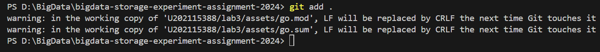
为了关闭这个警告可以将 core.autocrlf 设置为 false:
``` bash
git config core.autocrlf false
```
# 实验小结
## Objectsize 与各个参数的关系
结果依次如下:


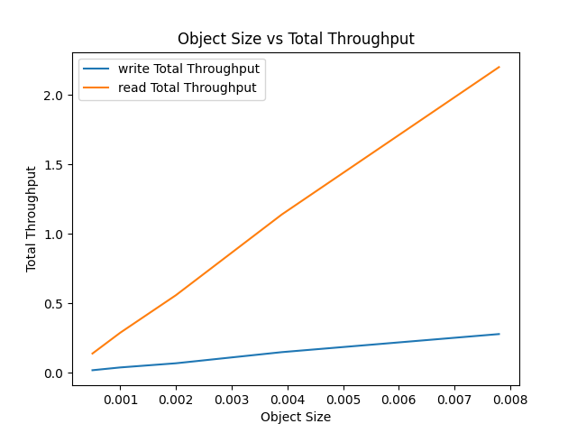

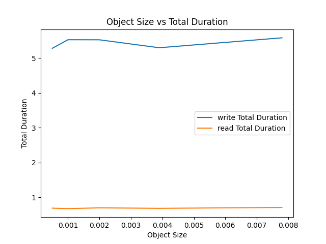

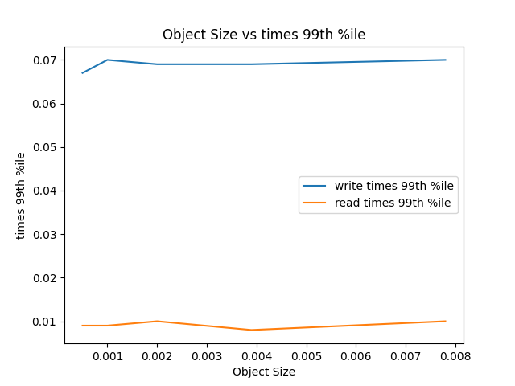

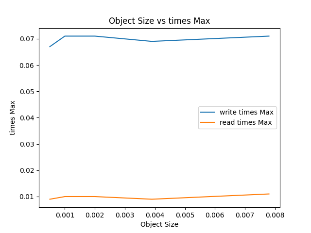

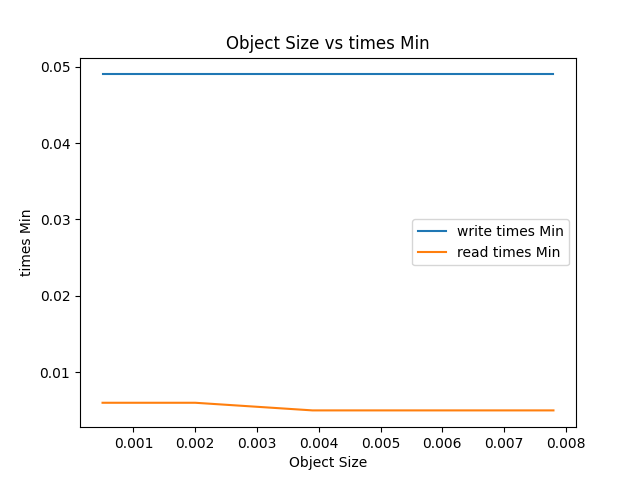

从这些结果中，我们可以看到随着 objectSize 的增加，Total Transferred、Total Throughput 也相应增加，这意味着更大的对象大小可以提高总吞吐量。同时，Total Duration 对于读取和写入操作来说，基本保持不变，这表明系统能够在处理更大的对象时保持稳定的性能。此外，Write times Max、Write times 99th %ile 和 Write times Min 以及对应的读取时间也基本保持不变，这进一步证明了系统在处理不同大小的对象时的稳定性。

这些结果符合理论预期。在分布式存储系统中，当增加每个对象的大小时，总的数据传输量（Total Transferred）和吞吐量（Total Throughput）通常会增加。这是因为大对象减少了每个对象的元数据开销，使得更多的带宽可以用于实际的数据传输。

同时，注意到，无论对象的大小如何，操作的总持续时间（Total Duration）都保持相对稳定。这是因为在这个测试中，无论对象的大小如何，都是传输固定数量的对象。因此，总的操作时间主要由网络延迟、存储系统的处理时间等因素决定，而这些因素与对象的大小无关。

最后，最大、最小和 99th 百分位的读写时间也基本保持稳定，这表明存储系统在处理不同大小的对象时，其性能表现是稳定的。这是一个良好的性能特性，因为它意味着存储系统可以预测和控制在不同工作负载下的性能表现。

## numClients 与各个参数的关系
绘制成图得到的结果如下所示:

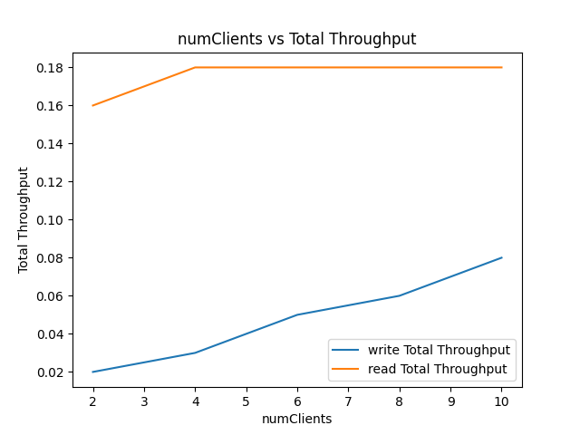

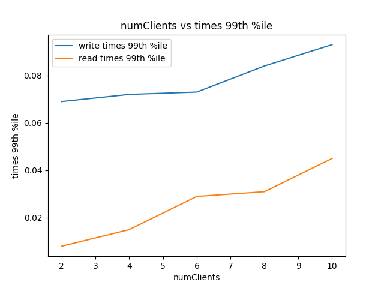

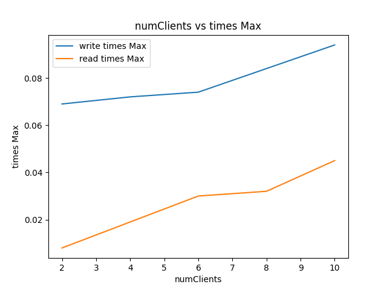

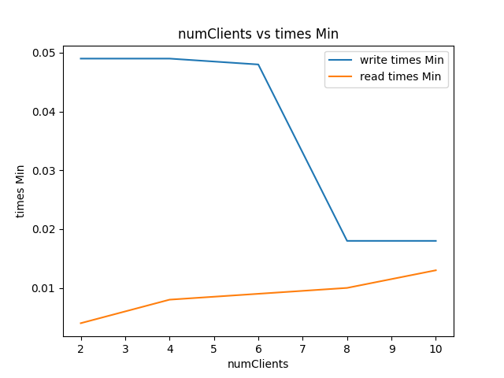

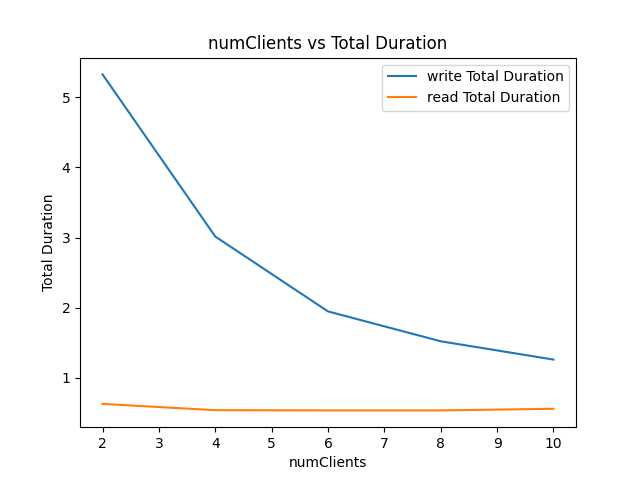

当客户端并发数增加时，服务器需要处理更多的请求，这可能会导致服务器的资源（如 CPU、内存、网络带宽）饱和，从而增加处理每个请求的时间，也就是说，延迟会增加。同时，由于服务器在单位时间内处理的请求数增加，所以吞吐量也会增加。

然而，这种增加并不是无限的。当服务器的资源达到饱和时，再增加并发数，服务器的吞吐量可能不会再增加，甚至可能会下降，因为服务器需要花费更多的时间来处理排队的请求，而不是处理新的请求。同时，由于资源饱和，每个请求的处理时间可能会大大增加，导致延迟显著增加。

我们可以看到，随着客户端数量的增加，写入的总持续时间（Total Duration）在减少，这意味着服务器能够在单位时间内处理更多的写入请求，因此写入的吞吐量（Total Throughput）在增加。然而，读取的总持续时间和吞吐量在客户端数量增加后基本保持不变，这可能是因为服务器的读取能力已经达到饱和。

同时，我们也可以看到，随着客户端数量的增加，最大的写入时间（Write times Max）和读取时间（Read times Max）在增加，这可能是因为服务器需要处理更多的并发请求，导致处理每个请求的时间增加。