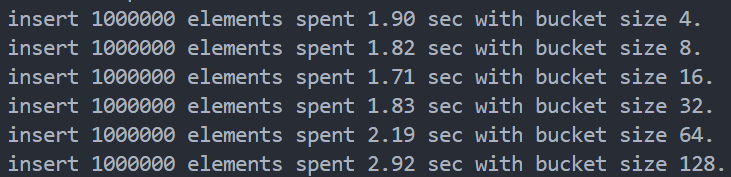

## 运行方式
在此目录运行 `make build` 可以在此目录生成测试程序的可执行文件cuckoo

在此目录运行 `make run` 可以自动运行cuckoo的示例程序

## 代码示例

lib内实现了`CuckooMap`类，它实现了`insert`、`find`、`erase`等多个成员函数，实现了迭代器、动态扩容等功能，并且提供了接口调节默认的填充因子、桶的容量等信息，使用方式基本与std::unordered_map相同，示例代码如下：
```C++
#include "lib/cuckoo.h"
struct P {
    int x;
    int y;
    bool operator==(P a) {
        return x == a.x && y == a.y;
    }
};
int main() {
    //创建map
    CuckooMap<int, int> f;
    //自定义的类型也能使用，不过需要手动指定一个哈希函数
    CuckooMap<P, std::string> fp(
        [](P a) { return std::hash<int>()(a.x) ^ std::hash<int>()(a.y); });
    // insert可以插入键值对，也可以直接插入pair，还可以用[]，也能用迭代器
    fp.insert({1, 2}, "hello world");
    fp.insert({{7, 9}, "hello cuckoo"});
    fp[{3, 4}] = "hello kitty";
    auto itfp = fp.begin();
    itfp->second += " 666";
    for (int i = 0; i < 10; i++) f.insert(rand(), rand());
    //可以使用:语法遍历
    for (auto v : fp) {
        printf("{(%d,%d),%s}\n", v.first.x, v.first.y, v.second.c_str());
    }
    //也可以用迭代器
    for (auto it = f.begin(); it != f.end(); it++)
        printf("(%d,%d) \n", it->first, it->second);
    //调整动态扩容的阈值（元素数量除以地址数量），默认是1
    f.change_limits(1.0);
    //调整每个桶最多可容纳的元素数量,默认是16
    f.change_num_limits(2);
    //清空
    f.clear();
    //判断是否为空
    printf("f.empty=%d fp.empty=%d\n", f.empty(), fp.empty());
    //查找
    assert(fp.find({1, 3}) == fp.end());
    auto it = fp.find({7, 9});
    printf("{(%d,%d),%s}\n", it->first.x, it->first.y, it->second.c_str());
    printf("count {1,2}=%d  count {2,5}=%d\n", fp.count({1, 2}),
           fp.count({1, 5}));
    //删除
    fp.erase(it);
    //查看元素数量
    printf("size of fp is %d now\n", fp.size());
}
```

## 减少无限循环的方法
### 替换策略
我使用一个链表来保存一个桶内的元素，插入元素如果两个桶均满，则随机选一个插入到链表尾部，并从链表首部弹出元素进行后续操作。这样子即便多次选择了同一个桶来进行替换，也能选中不同的元素，每个桶只有在桶内每个元素都被替换过以此后才会选中重复的元素，能够大大减小出现无限循环的概率
### 动态扩容
每次插入元素时都会检测容器的填充因子，如果超过阈值就会触发动态扩容，能够极大减小无限循环的概率。扩容时并不是简单地将容量乘以2，而是精心预设了28个不同大小的质数作为容量的备选值，这些备选值有助于使元素的分布更加均匀。
### 死循环（高次数循环）检测
有一个`conflicts`变量来检测桶满时发生替换的频率。每次触发替换时，将`conflicts`加上一，每次成功插入时，将`conflicts`除以二。这样，当每次插入时需要替换的次数越来越多时，`conflicts`就会开始增长。我对于`conflicts`的阈值设定的是`num_per_bucket*2`，这说明平均每次插入时需要替换相当于满满两个桶的量才能成功插入，说明此时的容量或哈希函数已经不适合当前的数据范围了，需要更换哈希函数或者扩容。
### 重新哈希
当`conflicts`达到阈值时会触发重新哈希，这个操作会重新生成随机的哈希函数（即便是用户为自定义的类型提供的哈希函数，也能自动重新生成），然后将元素在容器内重新排列。同时还会统计连续重新哈希的次数，如果连续三次重新哈希都没有解决问题，说明此时的问题已经不是修改哈希函数能解决的了，这个时候会触发动态扩容。

## 性能测试
测试代码在test.cpp中，设定阈值为0.1，改变桶的大小，进行测速，结果如下：

可以看到速度呈先减小后增大的趋势。

这是因为对于固定的阈值，桶的大小过小的话会频繁触发动态扩容，而大部分桶处于空的状态，造成时间和空间的浪费，同时由于桶的过小，所以触发替换的概率也会提高。

桶的大小过大的话，每个桶内的元素也会处于一个较多的状态，每次通过哈希找到对应的桶时，还需要花较多时间遍历链表才能找到对应的元素，浪费了时间。

因此，最佳的情况是桶的大小与阈值的乘积在1.5左右，也就是平均每个桶放一两个元素，因为这样既能充分地利用每个桶，又能防止元素在同一个桶内大量堆积。从测试结果也可以看到，当桶的大小为16时速度最快，也正是这个时候大小和阈值的乘积最接近1.5