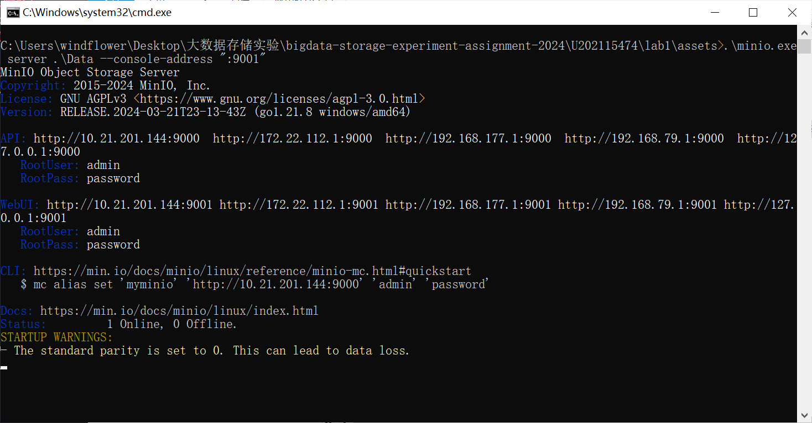
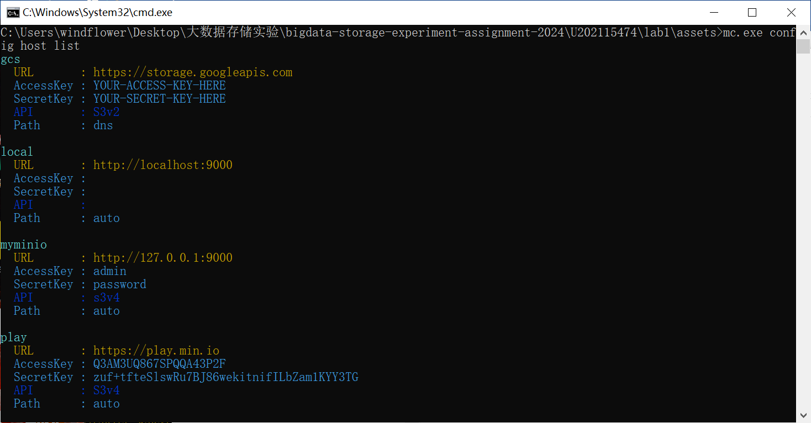
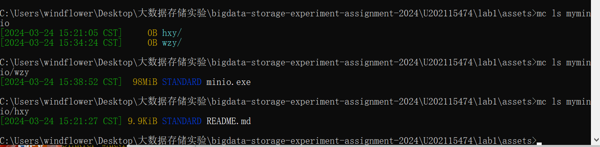
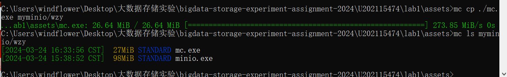
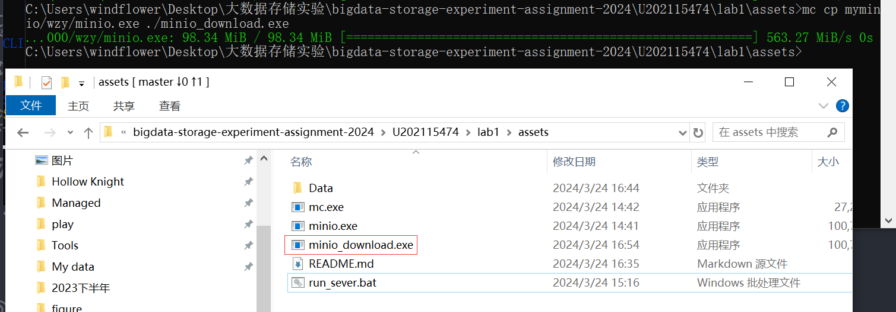
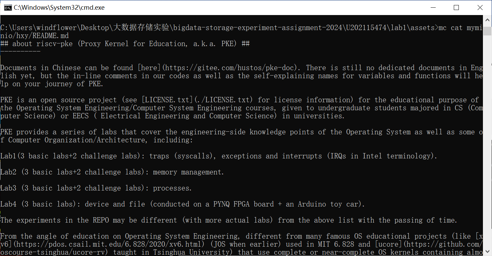
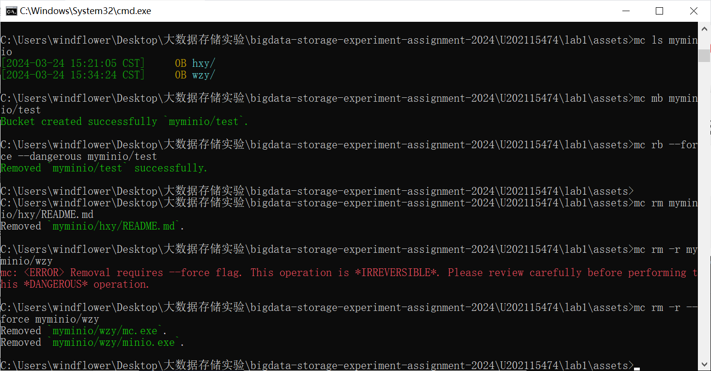

# 实验名称
环境搭建
# 实验环境
windows10
# 试验记录
- 服务端运行

- 客户端运行
    - 查看已配置的服务器
    
    - 查看服务器内容
    
    - 上传文件
    
    - 下载文件
    
    - 查看文件
    
    - 增删文件、文件夹、桶
    
# 实验小结
    速度好快，以后需要跟同学传大文件就用minio了