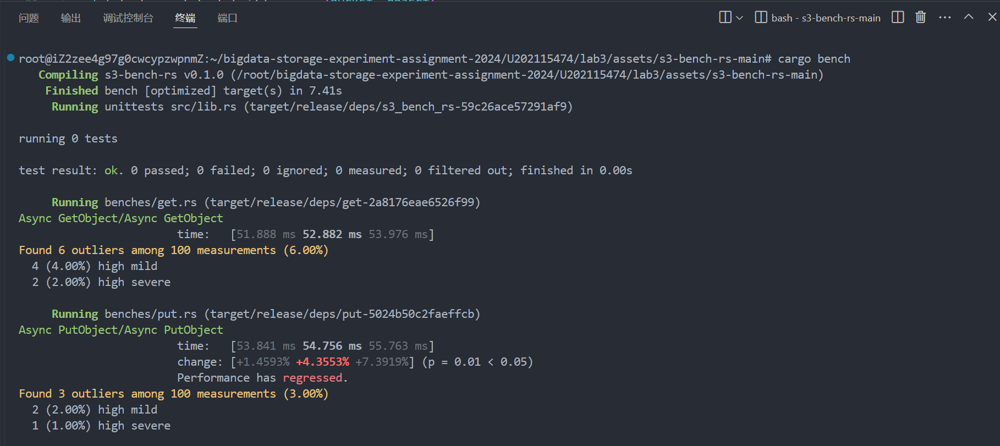
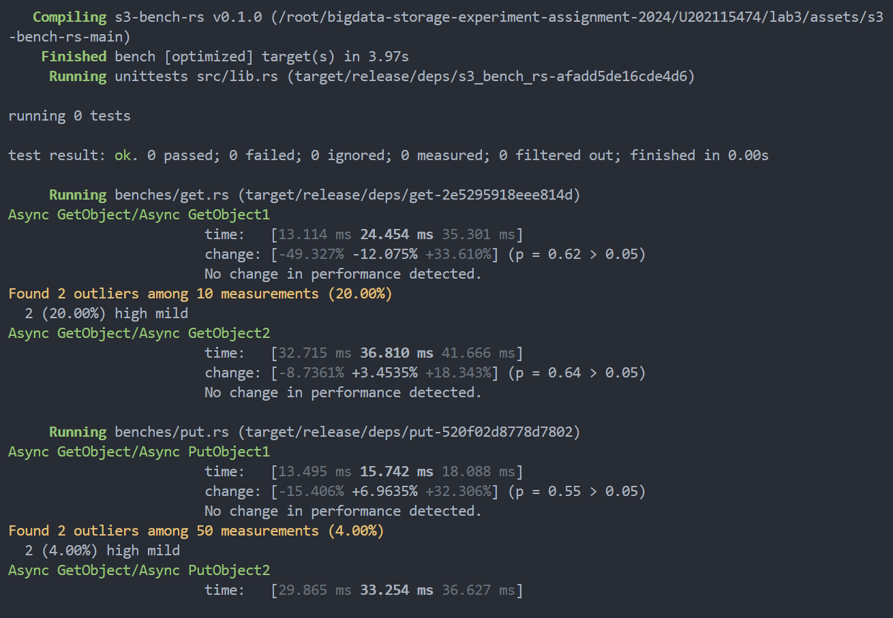

# 实验名称
性能分析
# 实验环境
Unbantu 22.04
# 试验记录
## 实验1 运行s3-bench-rs
1. ppt中给出的s3-bench-rs是三年前的库了，其中有个crate rust-s3更新了很多版，接口发生过更改，已无法正常使用，不过好在作者当时提交过pull request到rust-s3，所以可以使用`git reset 8e41`来回退到当时的版本，这是最简单的方法。

2. 还有一种就是修改s3-bench-rs的代码，首先需要在cargo.toml中添加`rust-s3 = "0.5.0"`，这样可以自动拉取最新版的rust-s3。因为新版的rust-s3的`Bucket::new()`加了参数生命周期的限制，传参时不能使用`&str`类型的参数，对于`&str`需要转化为String，以及`Bucket::new()`的第二个参数从`bool`改为了`UrlStyle`，也需要相应修改。修改后的`Bucket::new()`如下：
    ```rust
    let bucket = Bucket::new(self.endpoint.clone(), UrlStyle::Path, bucket.to_string(), self.region.clone()).unwrap();
    ```

3. 基准测试默认的运行次数是100次，最大运行时间是5S，可能会出现在规定时间内无法完成一百次运行的情况，这个时候可以用`Criterion` 的`sample_size()`函数来减小运行次数，或者用`measurement_time`来增大最大运行时间。这里我选择的是后者，get.rs修改后的代码如下，put同理：
    ```Rust
    fn criterion_benchmark(c: &mut Criterion) {
        let mut c = c.benchmark_group("Async GetObject");
        c.measurement_time(std::time::Duration::new(10, 0));
        c.bench_function("Async GetObject", move |b| {
            b.to_async(FuturesExecutor).iter(|| async {
                let _ret = get();
            })
        });
    }
    ```

服务端使用openstack-swift，运行结果如下：


## 实验2 修改s3-bench-rs
修改put.rs和get.rs两个文件，编写函数实现n个请求并行执行，研究并发数对响应时间的影响。

以get为例，函数如下：
```rust
#[tokio::main]
async fn getn(n:usize){
    let mut handles = vec![];
    for _ in 0..n {
        let handle = thread::spawn(move || async {
            task::spawn(get())
        });
        handles.push(handle);
    }
    // 等待所有线程完成
    for handle in handles {
        let _=handle.join().unwrap().await;
    }
}
```

之后运行s3-bench-rs，结果如下：


# 实验小结
在本次实验中我学会了使用基准测试对swift服务器的性能进行测试并查看尾延迟。