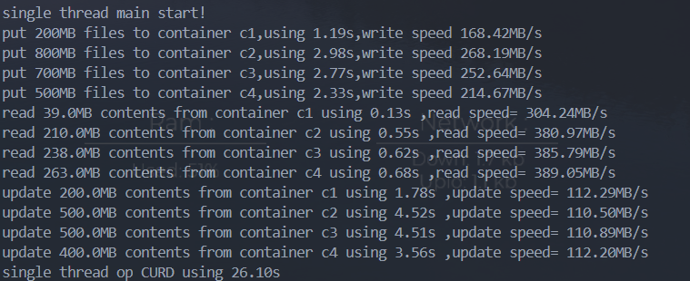

# 实验名称
    实践对象存储基本功能
# 实验环境
    Ubuntu 22.04
    Python 3.10.2 + swiftclient
# 实验记录
    1. 创建测试文件 test.txt(100MB,内容全为ASCII字符a), big.txt(200MB,内容全为ASCII字符'b')
    2. 使用python API连接swift
    3. 创建四个容器
    4. 随机向每个容器写入200MB-1GB的数据
    5. 随机从每个容器读取2MB-500MB数据
    6. 修改每个容器的所有对象,将其内容修改为对应大写字符
    7. 在下述两种情况下执行上述操作:
       1. 4个线程,每个线程对应一个容器，对容器执行相应操作
       2. 一个线程对所有容器执行操作

    4线程结果如下图所示:

    单线程结果如下图所示:

单线程的读，写和修改性能都明显优于4线程!!!  
结果推断 : Python有全局GIL,只能实现伪多线程并发，不能多线程并行,线程调度耗时长

# 实验小结
参考[Swift-API-Document](https://docs.openstack.org/python-swiftclient/latest/swiftclient.html)执行对应操作即可