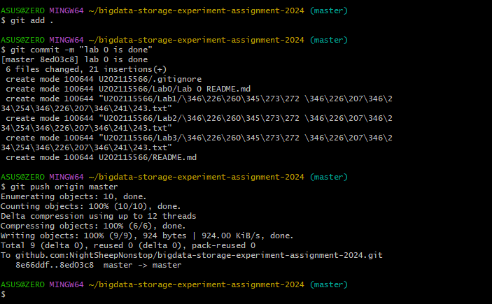
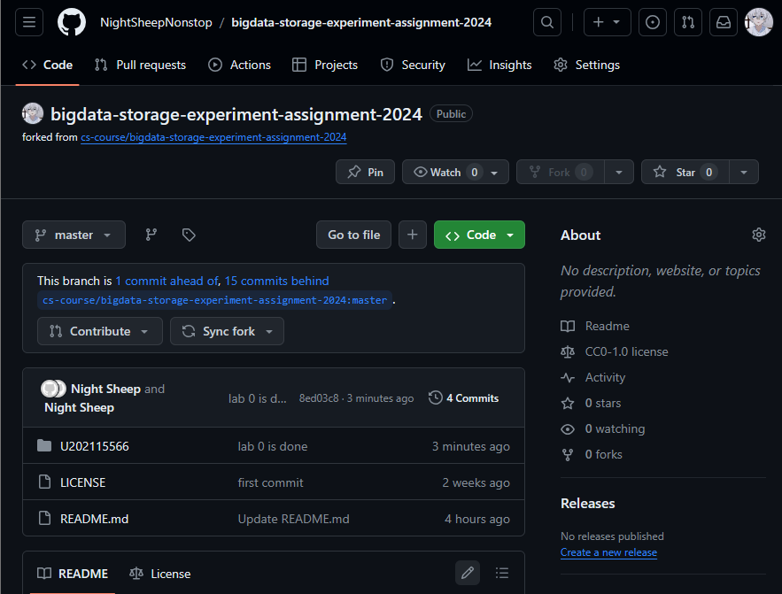

# 实验名称

Lab 0 准备作业库
# 实验环境

处理器	11th Gen Intel(R) Core(TM) i5-11400H @ 2.70GHz   2.69 GHz  
系统类型	64 位操作系统, 基于 x64 的处理器  
git version 2.41.0.windows.2  
# 实验记录

## 实验0-0：本地提交截图

## 实验0-1：提交后的仓库状态截图

# 实验小结

在GitHub上准备好了作业库