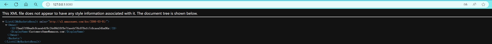

# 实验名称

Lab 1 搭建对象存储

# 实验环境

处理器	11th Gen Intel(R) Core(TM) i5-11400H @ 2.70GHz   2.69 GHz  
系统类型	64 位操作系统, 基于 x64 的处理器  
git version 2.41.0.windows.2  
服务器 s3proxy
客户端 boto3
# 实验记录
## 实验1-1：服务端

> 使用**S3Proxy**模拟AWS S3服务

1. 下载 S3Proxy release包
2. 配置config文件，config文件内容如下：
```java
s3proxy.authorization=none
s3proxy.endpoint=http://127.0.0.1:8080
jclouds.provider=filesystem
jclouds.filesystem.basedir=/tmp/s3proxy
```
3. 创建文件系统目录
```
mkdir /tmp/s3proxy
```
4. 运行S3proxy服务
```
java -jar s3proxy --properties s3proxy.conf
```

5. 在浏览器中查看详情

## 实验1-2：客户端

>使用boto3编程api

1. 下载boto3
```
pip install boto3
```
2. 在python中导入并使用boto3
```PYTHON
import boto3  
  
# 创建 S3 客户端  
s3 = boto3.client(  
's3',  
endpoint_url='http://127.0.0.1:8080'  
)  
  
# 创建存储桶  
bucket_name = 'test'  
  
s3.create_bucket(Bucket=bucket_name)  
  
print("Bucket created successfully.")  
  
# 列出所有存储桶  
response = s3.list_buckets()  
  
print("List of Buckets:")  
for bucket in response['Buckets']:  
print(bucket['Name'])
```
3. 运行结果

# 实验小结

使用S3Proxy+boto3搭建了对象存储系统，并进行了功能验证