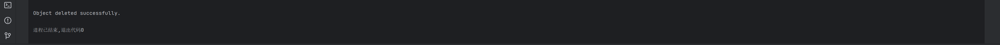

# 实验名称

Lab 2 实践基本功能

# 实验环境

处理器	11th Gen Intel(R) Core(TM) i5-11400H @ 2.70GHz   2.69 GHz  
系统类型	64 位操作系统, 基于 x64 的处理器  
git version 2.41.0.windows.2  
服务器 s3proxy
客户端 boto3

## 实验记录

1. 创建test.txt和new.txt文件用于后续测试
2. 创建客户端和存储桶（*lab1中已经完成*）
3. C操作:上传对象
```PYTHON
def create_object(bucket_name, file_path, object_key):  
# 上传文件到存储桶  
with open(file_path, 'rb') as file:  
s3.upload_fileobj(file, bucket_name, object_key)  
  
print("Object uploaded successfully.")
```

4. R操作：读取对象
```PYTHON
def read_object(bucket_name, object_key):  
# 获取对象内容  
response = s3.get_object(Bucket=bucket_name, Key=object_key)  
object_data = response['Body'].read().decode('utf-8')  
  
print("Object Content:")  
print(object_data)
```

5. U操作：更新并重新读取对象
```PYTHON
def update_object(bucket_name, new_file_path, object_key):  
# 上传新文件替换原有对象  
with open(new_file_path, 'rb') as file:  
s3.upload_fileobj(file, bucket_name, object_key)  
  
print("Object updated successfully.")
```

6. D操作：删除对象
```python
def delete_object(bucket_name, object_key):  
# 删除对象  
s3.delete_object(Bucket=bucket_name, Key=object_key)  
  
print("Object deleted successfully.")
```

# 实验小结

通过编写程序，实践了对象存储的CRUD操作