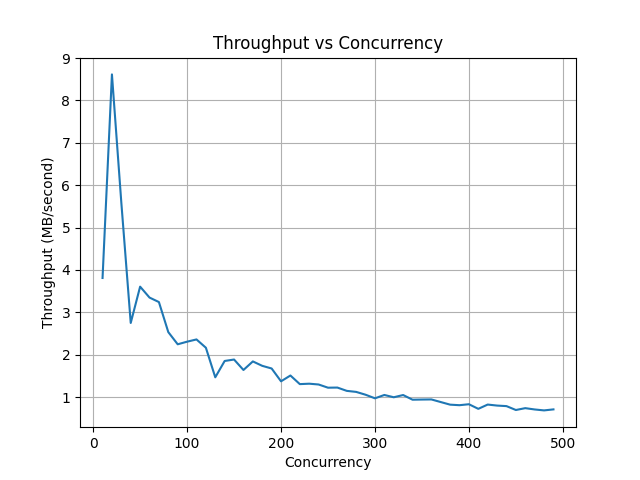
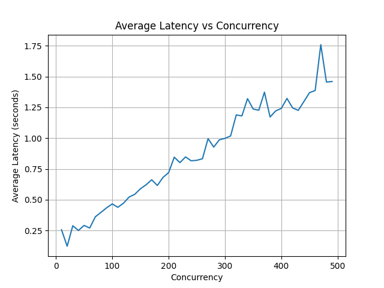

# 实验名称

---

## Lab 3 观测分析性能


# 实验环境

---

|   环境：   |            环境情况：            |
| :--------: | :------------------------------: |
| 操作系统： |            Windows 11            |
| 系统类型： | 64 位操作系统, 基于 x64 的处理器 |
| Git版本：  |   git version 2.41.0.windows.2   |
|  服务器：  |             S3proxy              |
|  客户端：  |              boto3               |

# 实验记录

---

- 对象尺寸设定为1MB，使用write函数生成：

```python
def create_file(file_path, size_in_bytes):
    with open(file_path, 'wb') as f:
        f.write(b'\0' * size_in_bytes)
```


- 并发数从10-500，两组之间的并发数差距为10，以并发上传为例
- 计算每个并发数时的吞吐率，吞吐率随并发数的变化趋势如下图所示。我们可以看到，吞吐量在一个短暂的增加之后，就开始随并发数的增加而下降，且在10-20左右时下降趋势最为明显



- 为了研究具体的存储系统性能，我们将并发数与吞吐率的乘积视为存储系统的实际处理能力，计算每个并发数时的系统的实际处理能力，其变化趋势如图所示。可以看出在并发数500以内，处理能力基本是随着并发数的增加而增加的。在并发数为200左右趋势开始趋于平稳


- 另一个影响用户体验的指标是平均延时，我们统计不同并发数时的平均延时，其变化趋势如图所示。平均延时基本随着并发数的增加线性增加，猜测这是由于增加并发数会增加系统的负载，可能导致系统资源的竞争和排队等待，进而导致任务的等待时间增加，从而增加平均延时。




# 实验小结

---

​		从上述实验过程中我们可以看出，为了保障存储系统的性能，系统的并发数并不是越多越好的，在一定的范围内提高并发数确实会有效提高系统的实际处理能力，但是处理能力的提高有一个边界，超过这个边界时处理能力的提升就较为缓慢，且随之带来的是更高的平均延时。在实际使用对象存储系统时要注意设置一个合理的并发数。
