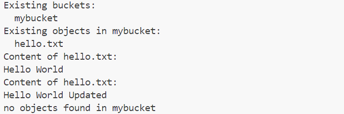

# 实验名称  

搭建对象存储

# 实验环境

docker + wsl2 + vscode

# 实验记录  

## 实验1-1: 搭建ceph集群

### 创建集群网络

``` shell
sh asserts/create_network.sh
```

### 拉取ceph镜像

`docker pull ceph/daemon:latest-luminous`

### 创建mon容器

``` shell
sh asserts/create_mon.sh
```

### 配置osd容器设置

`docker exec ceph-mon ceph auth get client.bootstrap-osd -o /var/lib/ceph/bootstrap-osd/ceph.keyring`

#### 修改配置文件

`docker exec ceph-mon echo -e "osd max object name len = 256\nosd max object namespace len = 64" >> /etc/ceph/ceph.conf`

### 启动三个osd容器

``` shell
sh asserts/create_osd_1.sh
sh asserts/create_osd_2.sh
sh asserts/create_osd_3.sh
```

### 创建mgr容器

``` shell
sh asserts/create_mgr.sh
```

### 开启dashboard

`docker exec ceph-mgr ceph mgr module enable dashboard`

### 搭建rgw节点

#### 配置rgw

`docker exec ceph-mon ceph auth get client.bootstrap-rgw -o /var/lib/ceph/bootstrap-rgw/ceph.keyring`

#### 启动rgw容器

``` shell
sh asserts/create_rgw.sh
```

### 添加测试用户

`docker exec ceph-rgw radosgw-admin user create --uid="test" --display-name="test user"`

获取用户的access_key和secret_key

``` text
"access_key": "AH9DO76Q4UA8YFJ0SZII",
"secret_key": "viYEqv4Pv0Hm0DP4pPrxFqhc9OZXQxHrnI5UXGUm"
```

将access_key和secret_key保存到文件中

``` shell
echo -e "[default]\naws_access_key_id = AH9DO76Q4UA8YFJ0SZII\naws_secret_access_key = viYEqv4Pv0Hm0DP4pPrxFqhc9OZXQxHrnI5UXGUm" > ~/.aws/credentials
```

### 测试集群

[测试代码](asserts/main.py)

输出如下:


# 实验小结

通过本次实验，我成功搭建了ceph集群，并通过s3接口测试了集群的功能。

# 参考资料

[docker搭建单机ceph集群](https://blog.csdn.net/aslifeih/article/details/135140411)

time: 2024-3-19 21:20