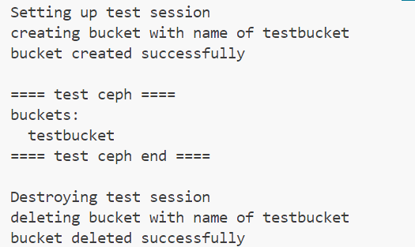
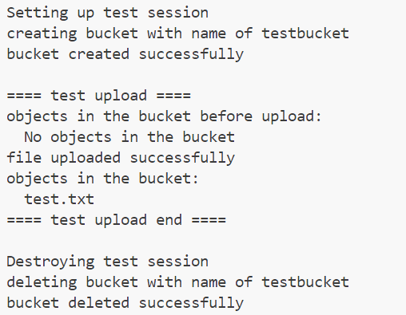
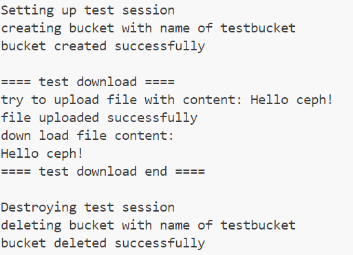

# 实验名称  

实践基本功能

# 实验环境

docker + wsl2 + vscode + go

# 实验记录  

## 实验2-1: 选择测试框架

本次实验选择go自带的测试框架进行测试。

利用aws-sdk-go调用ceph的s3接口，测试上传下载文件的功能。

[测试代码](asserts/s3_test.go)

测试方法：

``` shell
cd asserts
go test
```

## 实验2-2: 测试一 集群创建

测试函数：`TestCeph`

测试结果：



## 实验2-3: 测试二 上传文件

测试函数：`TestUpload`

测试结果：


## 实验2-4: 测试三 下载文件

测试函数：`TestDownload`

测试结果：


# 实验小结

在本次实验中我选取aws-sdk-go 来测试ceph的s3接口，通过编写了一系列测试函数，我成功测试了ceph集群的基本功能。
