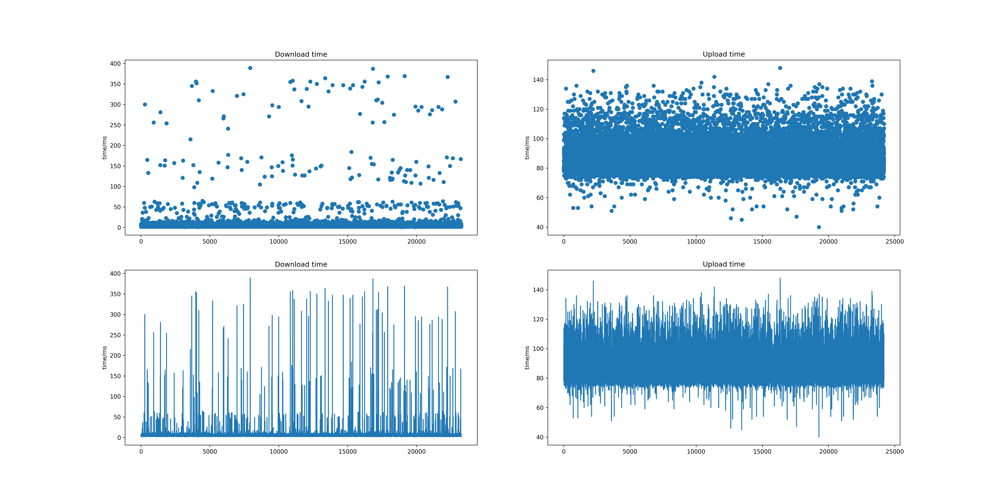
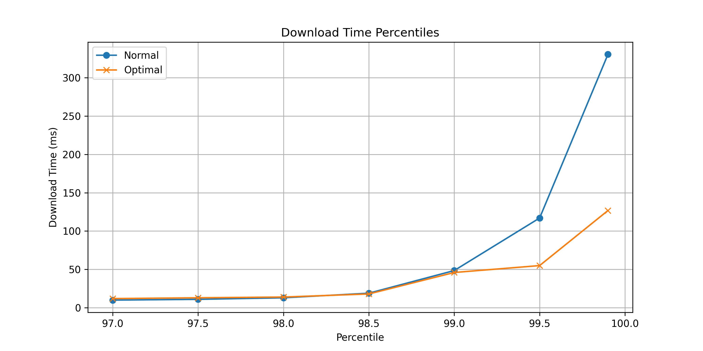
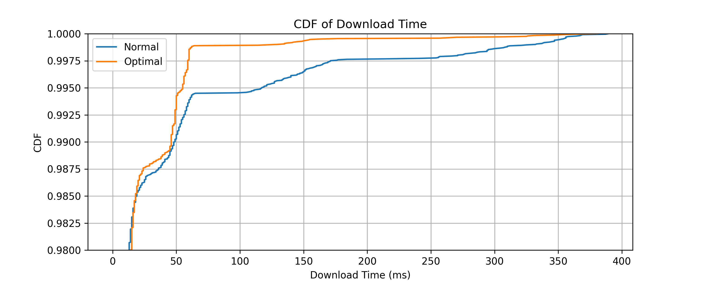
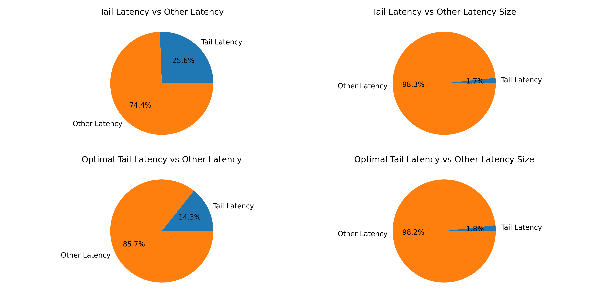

# 实验名称  

观测分析性能

# 实验环境

docker + wsl2 + vscode + go

# 实验记录  

**绘图脚本**: [main.ipynb](asserts/main.ipynb)

## 实验3-1: 拓展lab2代码, 用于观测尾延迟

### 函数介绍

- `concurrencyUpload`：并发上传文件  
- `concurrencyDownload`：并发下载文件  
参数介绍:  
  - `blockSize`：每个块的大小
  - `concurrency`：并发数
  - `totalFileSize`：所有文件的大小
- `testConcurreny`：测试并发上传和下载  
参数介绍:  
  - `blockSize`：每个块的大小
  - `concurrency`：并发数
  - `totalFileSize`：所有文件的大小
- `TestConcurrency3`  
参数设置:
  - `blockSize`：4kb
  - `concurrency`：10
  - `totalFileSize`：10mb
- `SingleUpload`: 无对冲请求的上传
- `SingleDownload`: 无对冲请求的下载
- `SingleUploadWithTailProfile`: 有对冲请求的上传
- `SingleDownloadWithTailProfile`: 有对冲请求的下载

## 实验3-2: 观测无对冲请求的上传和下载

### 实验方法

**测试函数**: `TestConcurrency4`

**测试方法**: 重复运行`TestConcurrency4`测试十次, 统计每次测试中每次下载和上传时间

**测试脚本**: [comp.sh](asserts/comp.sh)

**数据处理**:  

- 为了防止网络波动造成批量异常数据堆积, 我们对数据进行了打乱, 使得数据不呈测试次序的相关性
- 为了去除并发运行, 不同线程启动的时间不同造成的影响, 我们移除每次测试中上传部分的前**20**条异常数据

### 实验现象

为了方便呈现实验结果, 我们将实验结果绘制成图表, 此处我们展示了上传和下载的时间折线图和散点图来展现波动情况  

### 实验结果分析

此处声明下文中的**读**操作均为**下载**操作, **写**操作均为**上传**操作

- `写操作`  
从图中可以看出, 写操作的时间波动较小, 大多分布在**80ms** - **120ms**之间, 只有微量的数据分布在**120ms** - **160ms**之间和**40ms** - **80ms**之间

- `读操作`  
从图中可以看出, 读操作的时间波动较大, 大多分布在**2ms** - **12ms**之间, 同时有大量异常数据散布在**20ms** - **400ms** 之间

- `读写操作对比`  
从图中可以看出,读操作与写操作相比, 读操作的时间波动较大, 且波动范围较大, 写操作最小值与最大值的比率为**4**, 而读操作最小值与最大值的比率为**200**

### 实验结论

根据上述实验结果, 我们可以发现在ceph 对象存储系统中, 读操作出现了较为明显的**尾延迟**现象, 故我们继续进行实验3-3, 尝试优化读操作的**尾延迟**现象

## 实验3-3: 尾延迟优化

本实验采用的优化方法为: **对冲请求**

对冲请求的基本思想是: 当一个请求的延迟过大时, 我们可以发起一个对冲请求, 以期望能够在较短时间内完成请求, 从而减少尾延迟

### 实验方法

**测试函数**: `TestConcurrency3`

**测试方法**: 重复运行`TestConcurrency3`测试十次, 统计每次测试中每次下载和上传时间

**测试脚本**: [comp.sh](asserts/comp.sh)

**数据处理**: 同实验3-2

### 实验现象

为了呈现实验现象, 我们绘制了四幅图像, 分别为:

- 时间折线对比图

- 百分位线图

- CDF图

- 饼图

### 实验结果分析

- `时间折线对比图`  
从图中可以看出, 优化后的读操作中的大量延迟较大的异常点位置均有明显的下降, 同时在**12ms** - **50ms**之间的数据有所增加, 这是可能因为对冲请求发送的额外请求导致网络拥塞, 从而导致了部分数据的延迟增加
- `百分位线图`  
从图中可以看出, 优化后的读操作中的**尾延迟**现象有所减少, 从而使得**99.5%**的数据的延迟从**120ms**降低到**50ms**, 并且**99.9%**的数据的延迟从**400ms**降低到**130ms**
- `饼图`  
从图中我们可以看出, 发生尾延迟现象的请求, 在样本中所占比例很小, 但却占用了数倍于所占比例的时间, 这是尾延迟现象的典型特征, 优化前样本比例为**1.7%**, 但时间占比为**25.6%**, 优化后样本比例为**1.8%**, 变化不大, 但时间占比降为**14.3%**, 说明对冲请求优化后, 尾延迟现象明显有所减少
- `CDF图`  
结合饼图中尾延迟占比仅为**1.7%**, 在CDF 图中较为明显的变化点为**60ms**, 此时的优化前后的对应的CDF值分别为**0.995**和**0.999**, 下降了**0.4%**, 通过计算, 约有**25%**的延迟较大的尾延迟现象被优化掉了

# 实验小结

- 本次实验主要是对ceph对象存储系统中的读操作进行了性能分析, 通过实验我们发现, 读操作中存在较为明显的尾延迟现象, 通过对冲请求的优化, 我们成功的减少了尾延迟现象, 使得**99.9%**的数据的延迟从**400ms**降低到**130ms**, 优化效果明显

[**尾延迟**](https://www.gomomento.com/blog/why-tail-latencies-matter)：尾延迟是指在一组数据中, 有少量数据的延迟远远大于其他数据的延迟, 通常我们用最大值与最小值的比率来衡量尾延迟的程度

time: 2024-03-26 20:30
