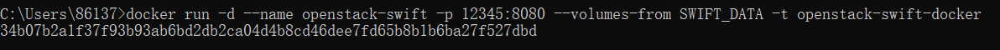
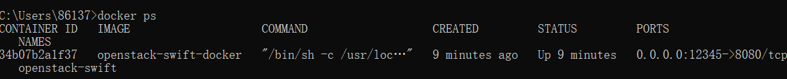
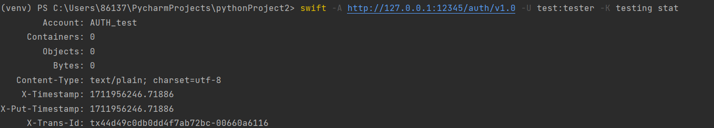

# 实验名称

搭建对象存储

# 实验环境

win11  Python 3.8.8

# 实验记录

## 实验1-1服务器的安装：
这里我选择的是openstack-swift作为实验的服务端，过程如下：
    
1、首先我们安装docker，网址：https://docs.docker.com/desktop/install/windows-install/

2、然后使用docker build -t openstack-swift-docker 构建docker镜像，openstack-swift-docker来自: https://github.com/cs-course/openstack-swift-docker

3、通过docker run -v /srv --name SWIFT_DATA busybox准备数据卷

4、docker run -d --name openstack-swift -p 12345:8080 --volumes-from SWIFT_DATA -t openstack-swift-docker运行，结果如下

5、通过docker ps检查容器，结果如下：

## 实验1-2客户端的安装：
1、在python中我们使用指令pip install python-swiftclient安装库

2、然后使用swift -A http://127.0.0.1:12345/auth/v1.0 -U test:tester -K testing stat访问服务端，结果如下：

# 实验小结

通过这次实验我成功创建了一个对象存储服务器和客户端，为之后的实验做好了准备