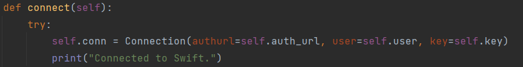
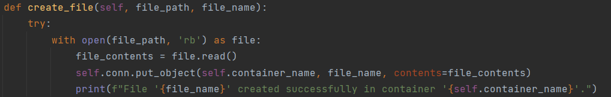
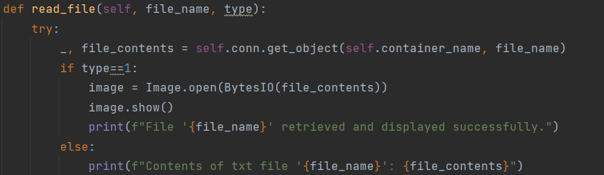
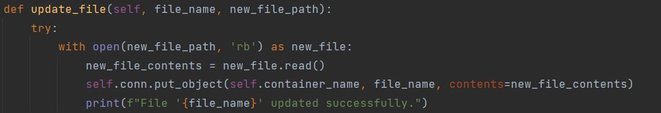
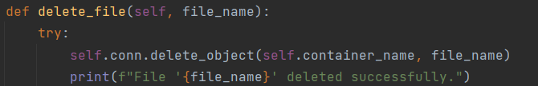
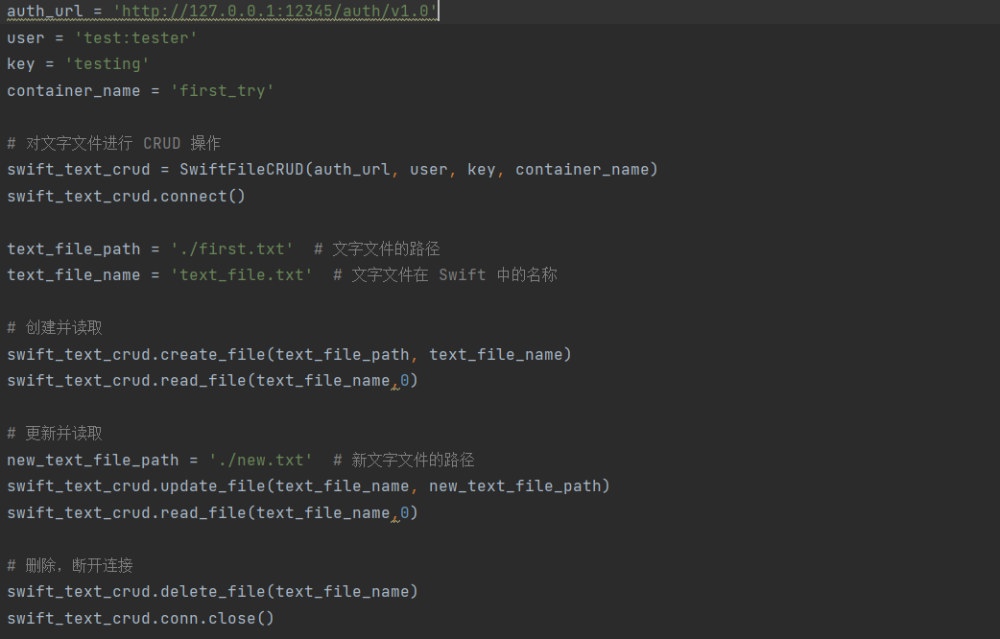
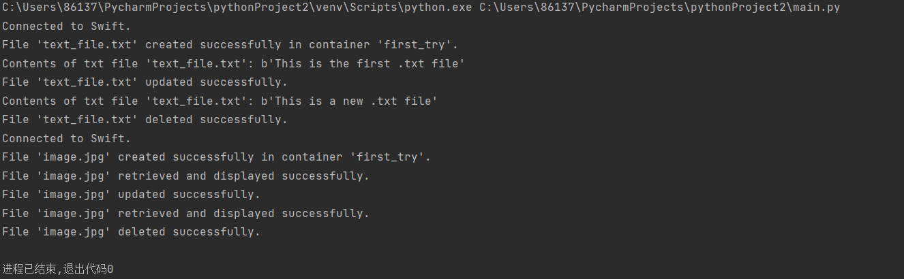

# 实验名称

实践基本功能

# 实验环境

Python 编程语言

OpenStack Swift 对象存储服务

# 实验记录

## 实验2-1：构建SwiftFileCRUD类
主要是五个函数的实现：connect、create_file、read_file、update_file、delete_file。分别对应swiftclient中Connection的Connection（）、put_object（）、get_object（）直接引用即可。

其中read区分了jpg文件和txt文件，1代表是图片文件，通过image.show()更好的输出

## 实验2-2：实际应用
1、连接到 Swift 服务：
使用 Connection 类建立与 Swift 服务的连接，并验证连接是否成功。

2、创建文字文件并读取：
使用 create_file 方法创建一个文字文件，并使用 read_file 方法读取该文件的内容。

3、更新文字文件并再次读取：
使用 update_file 方法更新已创建的文字文件，并使用 read_file 方法再次读取更新后的文件内容。

4、删除文字文件：
使用 delete_file 方法删除已创建的文字文件。

5、同上进行图片文件的CRUD

## 实验2-3：最终结果
文字文件创建、读取、更新和删除操作均成功执行，文件内容正确显示。

图片文件创建、读取、更新和删除操作也成功执行，图片内容正确显示。

如下图

# 实验小结

通过本次实验，我们学习了如何使用 Python 语言结合 OpenStack Swift 对象存储服务进行文件的 CRUD 操作。我们了解了连接 Swift 服务的方法，以及如何使用 Swift 客户端库进行文件的创建、读取、更新和删除操作。同时，我们也学会了如何处理不同类型的文件，包括文字文件和图片文件，并且能够将图片文件以图片方式正确地显示出来。这些操作对于实际开发和应用中的文件管理和存储操作具有重要的参考价值。