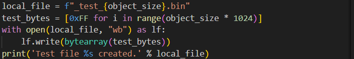
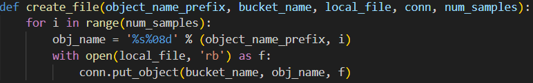
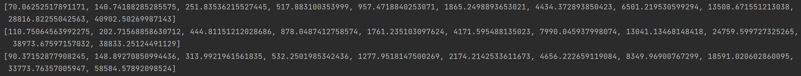
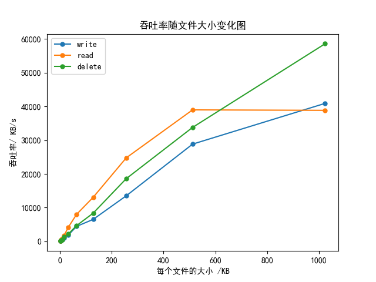

# 实验名称

观测对象尺寸如何影响性能?

# 实验环境

Python 编程语言

OpenStack Swift 对象存储服务

# 实验记录

## 实验3-1：连接对象存储系统
使用提供的认证信息连接到 Swift 对象存储系统，确保可以与系统进行通信。

## 实验3-2：测试不同大小的文件
固定总文件的大小为4MB，循环测试不同文件大小即object_size=$x^n$KB(0<=n<=10)的文件，数量为num_samples = 4096/object_size，记录创建、读取和删除三个操作在不同大小下的吞吐率。

1、 通过下列代码创建所需要的特定大小的文件：

2、对创建、读取、删除三个参数分别进行测试，这三个函数基本和lab2相同，只多了一个次数为num_samples的循环和一个命名操作（每次循环是对不同object）

3、在调用前后用time记录下开始和结束时间，这就是总时间，用4096KB$\div$总时间得到吞吐量，最后返回。三个测试完成后删除所有多余的文件，对下一个文件大小进行相同操作。输出的所有数据如下：

## 实验3-3：数据可视化分析
使用 Matplotlib 对各操作的吞吐率进行可视化分析，以更直观地展现性能随文件大小变化的趋势。如下：

进程的所有输出存放在./assets/ceshi_shuchu.txt中

# 实验小结

综上所述，本实验通过系统性的性能测试，揭示了对象存储系统在处理不同大小文件时的性能特点，为选择合适的文件大小以优化性能提供了重要参考。