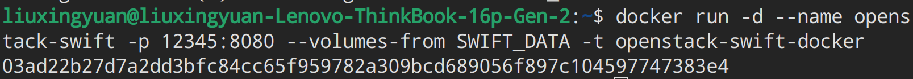

# bigdata-storage-experiment-assignment1

# **实验方法**

- 在服务器端安装 OpenStack Swift 作为对象存储系统的服务端。
- 在客户端搭建 Python 环境并使用 python-swiftclient 库与 Swift 进行交互。

# **实验环境**

- 服务器端：Ubuntu 22.04 LTS
- 客户端：Ubuntu 22.04 LTS

# **实验步骤**

## **服务端**

1. 克隆实验仓库：[https://www.convert.com/blog/a-b-testing/create-centralized-ab-testing-repository/](https://github.com/cs-course/openstack-swift-docker)
2. 进入仓库目录并运行以下命令：

`docker build -t openstack-swift-docker .`

3. 运行以下命令启动容器：

`docker run -d --name openstack-swift -p 12345:8080 --volumes-from SWIFT_DATA -t openstack-swift-docker`

4. 检查容器是否启动成功：

`docker ps`

## **客户端**

1. 安装 Python 3 和 pip。
2. 使用 pip 安装 python-swiftclient 库。
3. 运行以下命令验证库是否安装成功并检查服务端信息：
`swift -A http://127.0.0.1:12345/auth/v1.0 -U test:tester -K testing stat`

4. 上传文件到服务端：

5. 查看服务端容器列表：

可以发现服务端新建了一个名为 swift 的容器。

6. 下载文件到客户端：

# **实验结果**

- 服务端成功启动并创建了名为 swift 的容器。
- 客户端成功安装了 python-swiftclient 库并与服务端进行了交互。
- 有关文件成功上传到服务端并下载到客户端。

# **实验心得**

- Docker 提供了一种便捷的部署方式，可以快速将 OpenStack Swift 部署到服务器上。
- python-swiftclient 库提供了方便的操作 Swift 的接口，可以轻松地将文件上传到服务端并下载到客户端。

###
