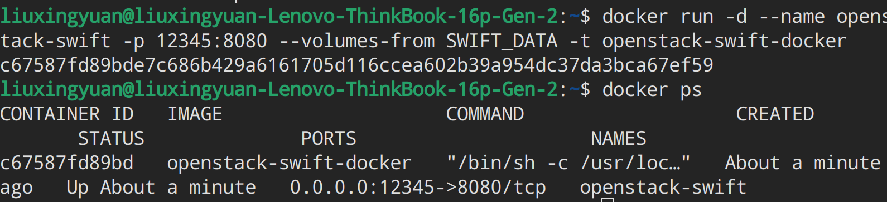
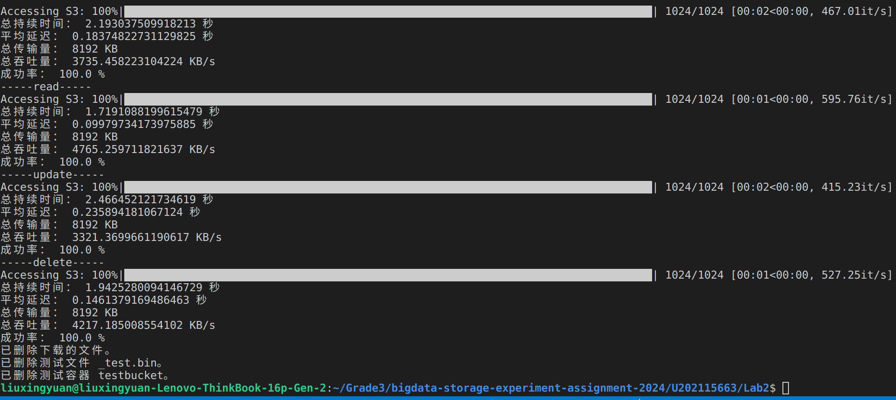

# bigdata-storage-experiment-assignment2

# **实验方法**

使用 Python 脚本对 Swift 存储系统进行测试，测试其是否可以完成写入、读取、更新和删除对象的相关操作。

# **实验环境**

- 服务器端：Ubuntu 22.04 LTS + Docker
- 客户端：Ubuntu 22.04 LTS + Python3.10

# **实验步骤**

## 准备环境

部署 Swift 存储系统并确保可通过 HTTP 协议访问。



安装必要的 Python 模块，包括 swiftclient、matplotlib 和 tqdm。
配置 Swift 存储的端点、凭据、容器名称等参数。

```python
# Swift 存储的端点和凭据
endpoint = 'http://127.0.0.1:12345/'
_user_ = 'test:tester'
_key_ = 'testing'
```

## 编写测试脚本

创建一个 Python 脚本，包含上传对象、获取对象、删除对象、更新对象等操作的函数。这里我部分参考了2020级大数据存储技术课程的实验仓库代码，并在此基础上进行编写：

- 定义上传对象的函数

    ```python
    def bench_put(i):
        obj_name = f"{object_name_prefix}{i:08d}"  # 生成对象名称
        start = time.time()
        with open(local_file, 'rb') as f:
            conn.put_object(bucket_name, obj_name, f)  # 上传文件对象
        end = time.time()
        duration = end - start
        client = current_thread().name
        return (duration, start, end, client)
    ```

- 定义删除对象的函数

    ```python
    def bench_delete(i):
    obj_name = f"{object_name_prefix}{i:08d}"  # 生成对象名称
    start = time.time()
    conn.delete_object(bucket_name, obj_name)
    end = time.time()
    duration = end - start
    client = current_thread().name
    return (duration, start, end, client)
    ```

- 定义更新对象的函数

    ```python
    def bench_update(i):
    obj_name = f"{object_name_prefix}{i:08d}"  # 生成对象名称
    start = time.time()
    
    # 更新对象
    with open(local_file, 'rb') as f:
        conn.put_object(bucket_name, obj_name, f)

    end = time.time()
    duration = end - start
    client = current_thread().name
    return (duration, start, end, client)
    ```

- 定义获取对象的函数

    ```python
    def bench_get(i):
    obj_name = f"{object_name_prefix}{i:08d}"  # 生成对象名称
    start = time.time()
    resp_headers, obj_contents = conn.get_object(bucket_name, obj_name)
    with open(obj_name, 'wb') as f:
        f.write(obj_contents)
    end = time.time()
    duration = end - start
    client = current_thread().name
    return (duration, start, end, client)
    ```

随后，编写主函数，包括对每种操作类型的性能测试，并将测试结果写入文件。
设置测试参数，如对象大小、样本数、客户端数量等。

## 执行测试

使用 run_test 函数依次对写入、读取、更新和删除操作进行性能测试。
在每种操作类型测试完成后，删除下载的文件和测试文件，以及删除测试容器，确保下次测试的干净环境。

# **实验结果**

读取存储了测试结果的文件，解析各项性能指标，我这里记录的是不同client下的CURD四项基本操作的吞吐量和平均延迟。保存在result.txt文件中。

# **实验心得**

python-swiftclient 库提供了方便的操作 Swift 的接口，可以轻松地将文件上传到服务端并下载到客户端，同时文件的读取和修改也十分便捷。

###
