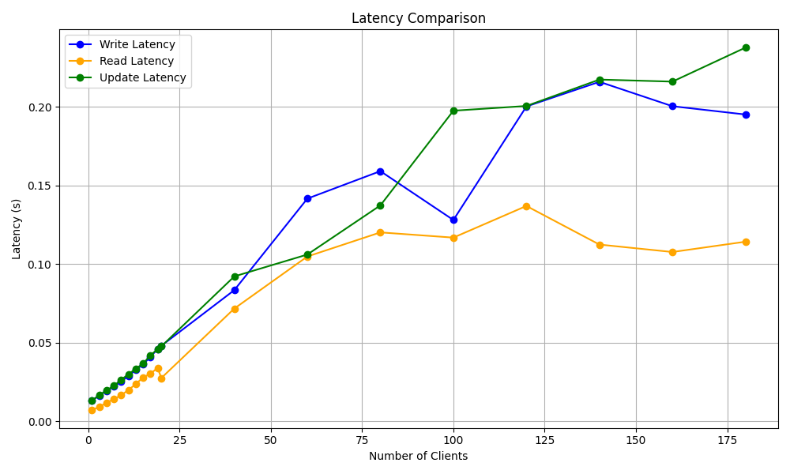
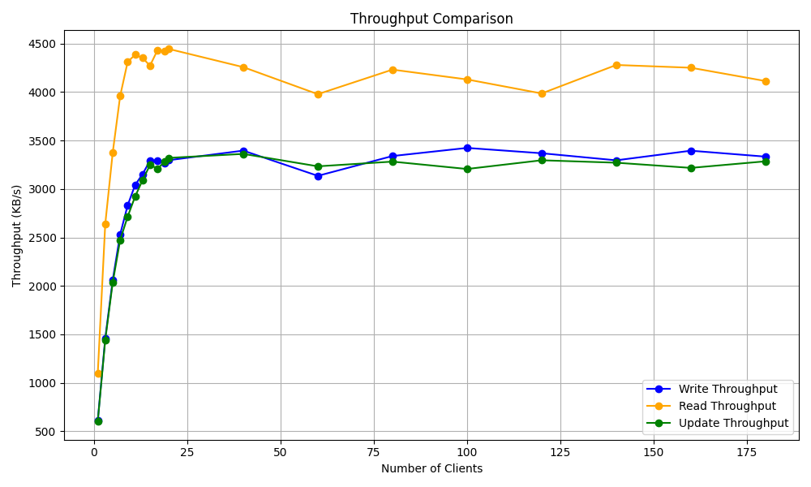
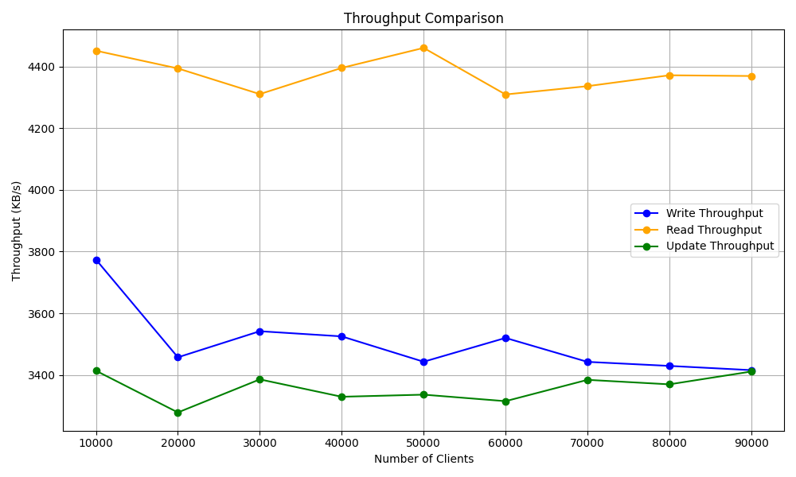

# bigdata-storage-experiment-assignment3

# **实验内容**

## 观测分析性能

* 如果客户端爆满将怎样?

* 请求并发数如何同时影响延迟分布和吞吐率？如何保障服务质量？

我们将针对上述问题进行实验和分析。

# **实验环境**

* 服务器端：Ubuntu 22.04 LTS + Docker + swift
* 客户端：Ubuntu 22.04 LTS + Python3.10 + swift_client

# **实验步骤**

## 查阅相关资料

Swift 构筑在比较便宜的标准硬件存储基础设施之上，无需采用 RAID，通过在软件层面引入一致性散列技术和数据冗余性，牺牲一定程度的数据一致性来达到高可用性和可伸缩性，支持多租户模式、容器和对象读写操作，适合解决互联网的应用场景下非结构化数据存储问题。

存储节点在Swift云存储系统中起着核心作用。它们不仅提供了数据的物理存储，还负责处理数据的检索、备份、恢复等任务。每个存储节点都拥有一定的数据存储和数据处理能力，它们的分布式存在使得Swift系统具有很高的可靠性和可扩展性。
Swift存储节点的设计充分考虑了分布式系统的特点。它们通过哈希算法将数据对象映射到特定的存储节点，这样既保证了数据的均匀分布，也使得数据访问具有高效性和可靠性。

我们知道，Swift是一个**分布式存储系统**。

结合分布式系统的基本原理，在一定范围内，随着并发数的增加，吞吐率会增加，因为分布式系统可以充分利用资源，同时处理多个请求。

但是，分布式系统这意味着需要保证数据的一致性问题。而 Swift 采用 Quorum 仲裁协议：

* 写操作的Quorum条件： 在进行数据更新（写操作）时，需要确保至少有大多数（通常是超过一半）的数据副本被成功写入，以确保数据的一致性。这可以防止部分节点故障或数据丢失，从而保障系统的可用性。

* 读操作的Quorum条件： 在进行数据读取操作时，需要从至少一个Quorum中获取数据，以确保读取到的数据是最新的版本。通常情况下，读操作的Quorum条件也是超过一半的数据副本。这可以避免读取到过期或失效的数据，保障数据的一致性和可用性。

Quorum仲裁协议虽然可以提高系统的性能和可用性，但也会增加系统的复杂度和开销。**因为在我们读写和更新数据时，需要进行多次数据交互和协调来保证其一致性，这会增加网络通信和数据传输的时间和空间开销，降低系统的吞吐率和增加延迟**。

所以我们综合考虑：

### **延迟分布**

* 高并发下延迟增加： 当客户端并发请求增加时，系统可能面临更多的请求排队等待处理的情况。这会导致平均请求处理时间增加，延迟随之增加。因此，随着并发数的增加，延迟往往会呈现出逐渐增加的趋势。

* 尾部延迟扩大： 在高并发情况下，一些请求可能会因为资源竞争或系统负载过重而导致延迟较高。这些延迟较高的请求将会导致尾部延迟扩大，即部分请求的延迟明显高于平均延迟，可能会影响用户体验。

### **吞吐率**

* 并发数提升可能带来吞吐率上升： 在低并发情况下，系统可能未能充分利用资源，吞吐率受限于系统的处理能力。增加并发数可能会使系统更好地利用资源，提高并发处理能力，从而提升吞吐率。

* 达到瓶颈后吞吐率下降： 然而，一旦系统达到瓶颈，增加并发数可能会导致资源竞争和排队等待，从而降低吞吐率。当系统无法有效处理更多的并发请求时，吞吐率可能会达到一个峰值并开始下降。

## 开展实验和实验分析

我们在实验二的基础上，对 num_clients 进行设置，观察并发数对延迟分布和吞吐率的影响。

我们发现，延迟很明显的随着 Client 的数量的增加而增加。这说明 Swift 对象存储系统在进行CRUD时，处理延迟会随着并发数增加。

我们发现，在一定的范围内，吞吐率随着 Client 的数量的增加而增加。这说明 Swift 对象存储系统在进行CRUD时，处理吞吐率会随着并发数增加。

但是，当 Client 的数量达到一定的值时，吞吐率会基本保持不变。这说明 Swift 对象存储系统在进行 CRUD 时，处理吞吐率会达到一个峰值并保持稳定。

当我们进一步大幅度增加 Client 的数量：

发现延迟和吞吐率都保持基本稳定， Swift 对象存储系统在进行CRUD时，处理延迟和吞吐率会达到一个稳定值？ 但是这显然不符合**分布式系统的排队队列延长延迟增加**的逻辑：

在理想情况下，随着客户端数量的增加，延迟通常会增加。这是因为随着并发操作的增加，系统需要处理更多的请求，从而导致处理每个请求的排队时间增加，进而增加延迟。

我估计是因为 Swift 对象存储系统的一些保护机制，当 Client 的数量达到一定的值时，系统会自动限制 Client 的数量或者将部分 Client 阻塞，以保证系统的稳定性。

同时，我们还有一些额外的发现：**读吞吐量明显高于写吞吐量，读延迟明显低于写延迟**。

分布式系统中的一致性协议（如Paxos、Raft等）可能会影响写操作的延迟和吞吐量。一些一致性协议可能会引入额外的通信和同步开销，从而导致写入延迟增加。而一些针对读操作进行了优化的协议（如读写分离、多版本并发控制等），可以降低读操作的延迟并提高吞吐量。

这 Swift 对象存储系统在进行读操作时，处理吞吐率和延迟会明显优于写操作。这也符合分布式系统的特点，读操作通常比写操作更快。我们的实验结果也成功验证了这一点。

为了保证服务质量，我们需要根据实际情况**合理设置并发数，避免过高的并发数导致系统性能下降**。同时，我们还可以通过优化系统架构、调整配置参数等方式来提高系统的性能和可靠性。

# **实验总结**

本次实验通过编写程序，观察分布式存储系统 **Swift** 中客户端数量对延迟分布和吞吐率的影响，我进一步了解了分布式系统在处理大规模并发请求时的表现和特点。

并发对延迟和吞吐率的影响： 通过实验，我展示了并发请求数量对系统延迟和吞吐率的影响。随着客户端数量的增加，延迟逐渐增加，而吞吐率在一定范围内随着客户端数量的增加而增加。这说明分布式系统在面对高并发请求时，会出现延迟增加和吞吐率提升的情况，但也有可能达到一定的稳定状态。

系统的稳定性与保护机制： 实验中观察到当客户端数量达到一定值时，系统的延迟和吞吐率保持基本稳定。这***可能***是由于系统实现了一些保护机制，如限制客户端数量或进行流量控制，以防止系统过载或崩溃。

读写操作的差异： 实验结果显示了读操作的吞吐率明显高于写操作，并且读操作的延迟明显低于写操作。这符合分布式系统的一般特点，即读操作通常比写操作更快。这可能是因为读操作通常可以从本地副本或缓存中获取数据，而写操作需要进行数据复制和一致性协议的处理，导致延迟较高。

# **实验心得**

通过一些分布式系统的学习和 Swift 实验，我进一步认识到设计和管理分布式系统所面临的挑战。在提高系统性能的同时，需要解决并发控制、数据一致性、负载均衡等问题，以确保系统的稳定性和可靠性。分布式系统的设计需要综合考虑各种因素，平衡系统的性能、可用性和一致性等需求。

###
